# Complexo Industrial da Censura no Brasil  

```mermaid
mindmap
  root((Operação Tio Joe))
    Introdução
      Interferência EUA em 2022
      Comparação com Brother Sam
    Judiciário
      Confissão de Barroso
      Apoio ao TSE
    Diplomacia
      Visitas oficiais
        CIA e Assessores Biden
      Comitivas brasileiras
    Financiamento
      ONGs e Campanhas
        Mobilização jovens
        Transporte gratuito
    Censura
      Big Tech e Remoções
      Complexo Industrial
        DFRLab e NED
    Linha do Tempo
      Eventos 2021-2022
    Conclusão
      Ironias e Consequências
```

## Participação no I Fórum da Liberdade de Expressão de Westminster  
- 🗣️ Evento reuniu jornalistas, intelectuais e ativistas para debater censura  
- 🌍 Manifesto de 140 signatários denunciou violações à liberdade de expressão  

## Intercâmbio Internacional de Estratégias de Censura  
- 🔄 Países ocidentais, como EUA, Canadá, Irlanda e Austrália, trocam práticas censórias  
- 🇧🇷 Brasil é exemplo e peça-chave no Complexo Industrial da Censura (CIC)  

## Definição e Origem do Complexo Industrial da Censura (CIC)  
- 📁 Revelação dos Twitter Files expôs envolvimento de agências governamentais na moderação de conteúdo  
- 🕵️‍♂️ Agências como CIA e FBI influenciam diretamente a supressão de informações  

## Casos Notórios de Censura: O Laptop de Hunter Biden  
- 🖥️ Twitter bloqueou reportagem do New York Post sobre Hunter Biden antes das eleições de 2020  
- 📞 FBI manteve comunicação direta com executivos do Twitter para controlar narrativa  

## Expansão da Rede de Controle e Monitoramento  
- 🌐 Colaboração entre governos, ONGs, empresas de tecnologia e instituições acadêmicas  
- 🤖 Uso combinado de manipulação psicológica e inteligência artificial para silenciar vozes dissidentes  

## Influência do Judiciário Brasileiro no CIC  
- ⚖️ TSE e STF lideram políticas de censura no Brasil  
- 🔗 Rede complexa envolvendo os três poderes, ONGs, imprensa e militantes digitais  

## Histórico e Estruturação da Censura no Brasil  
- 📅 Início em 2017 com reuniões secretas do TSE para combater "desinformação" nas eleições  
- 🛡️ Criação do CIEDDE para enfrentamento da desinformação e defesa da democracia  

## Principais Organizações e Laboratórios Envolvidos  
- 🏛️ DFRLab, Information Futures Lab, Meedan e NetLab atuam na censura e verificação de fatos  
- 📰 Uso de relatórios para justificar perseguições políticas e censura judicial  

## Financiamento da Censura no Brasil  
- 💰 Fundações internacionais como Open Society, Ford Foundation e OAK Foundation financiam iniciativas  
- 🛑 Organizações como Sleeping Giants Brazil e Instituto Vero pressionam contra mídia conservadora  

## Vitórias e Resistência Contra a Censura  
- ✊ Exposição do judiciário brasileiro via Twitter Files Brasil causou impacto internacional  
- 📜 Relatórios e cartas de parlamentares dos EUA denunciaram perseguição política no Brasil  
- 🚫 Fechamento do Observatório da Internet de Stanford, ligado à censura durante a pandemia e eleições  

## Desafios e Perspectivas Futuras  
- 🔍 Aumento da conscientização global sobre ameaças à liberdade de expressão  
- 🔥 Resistência crescente contra ataques do Complexo Industrial da Censura  
- 🌱 Necessidade de fortalecer cultura em prol da liberdade de expressão, além do viés político

Fonte: [ainvestigacao](https://www.ainvestigacao.com/p/operacao-tio-joe-a-influencia-dos)

# Complexo de Censura

Aplicação web interativa (usando tecnologias como React para frontend, Node.js para backend e MongoDB para banco de dados) que visualize e gerencie uma linha do tempo da censura no Brasil, com base nas seguintes informações consolidadas de discussões históricas e recentes:

## Estrutura Geral da Aplicação:

  - Interface principal: Uma timeline interativa (usando bibliotecas como Vis.js ou TimelineJS) dividida em períodos (Colonial até Atual), com filtros por ano, tipo de censura (judicial, midiática, eleitoral) e alvos (conservadores, jornalistas de direita, bolsonaristas).
  - Funcionalidades: Busca por eventos, adição de novos eventos por usuários moderados, exportação para PDF/CSV, e integração com APIs de redes sociais para atualizações em tempo real (ex.: X/Twitter via API pública).
  - Segurança: Autenticação de usuários, moderação de conteúdo para evitar fake news, e conformidade com leis de privacidade (LGPD).

## Conteúdo Baseado em Dados Fornecidos:

Períodos Históricos: Inclua eventos desde o período colonial (1500–1822: proibições pela Inquisição), imperial (1822–1889: repressão a movimentos), República Velha (1889–1930: leis de imprensa), Era Vargas (1930–1945: DIP e censura intensa), Ditadura Militar (1964–1985: AI-5 e repressão), e pós-1985 (democracia com censuras judiciais).
Foco em Eventos Recentes (2019–2025): Agrupe ações judiciais do STF/TSE (principalmente Alexandre de Moraes) contra conservadores nas redes:
  - 2019: Inquérito das Fake News; censura à Crusoé e O Antagonista.
  - 2020: Banimento do Terça Livre; autoexílio de Allan dos Santos.
  - 2021: Bloqueios de contas de bolsonaristas; censura a documentários.
  - 2022: Suspensão do Telegram; censura eleitoral a questionamentos sobre urnas.
  - 2023: Ameaças a plataformas; censuras a reportagens críticas.
  - 2024: Suspensão do X (Twitter); censura a paródias e revistas.
  - 2025: Bloqueio da Revista Timeline; decisões do STF obrigando remoção de conteúdos sem ordem prévia.

Fontes: Integre dados de sites independentes como Gazeta do Povo, Revista Oeste, Cláudio Dantas, The Investor, Hora Brasília e NYT (para equilíbrio), evitando fontes financiadas pelo governo.

## Referências

- [1](https://x.com/AlexandreFiles)
- [2](https://x.com/ZambelliRita_)
- [3](https://x.com/jalinformei/status/1778373331508462015)
- [4](https://x.com/RacismoFree13/status/1776774921345028227)
- [5](https://x.com/FabioTalhari)
- [6](https://x.com/TheIncorrupt_/status/1821707718903677212)
- [7](https://x.com/elevamiami/status/1653397645358972928) 
- [8](https://x.com/misteriouspavao/status/1827739611763740939)
- [9](https://x.com/AdvogadosOacb)
- [10](https://x.com/Mari26910508/status/1781098559619661875)
- [11](https://x.com/defariasoficial/status/1622803325220540416)
- [12](https://x.com/realpfigueiredo)
- [13](https://x.com/Mari26910508/status/1888384989391118573)
- [14](https://x.com/fabio_talhari/status/1807738267485262174)
- [15](https://x.com/PATRlOTAS)
- [16](https://x.com/DaviSacer)
- [17](https://x.com/adriana75171/status/1825608715824955397)
- [18](https://x.com/marcosdoval)
- [19](https://x.com/EdwardG0422/status/1669436691327733769)
- [20](https://x.com/adriana75171/status/1825626534671265797)
- [21](https://x.com/hipatiaredpill/status/1888390690851246461)
- [22](https://x.com/AlexandreFiles/status/1829979981130416479)
- [23](https://x.com/AlexandreFiles/status/1831063051790958660)
- [21](https://x.com/HalynyMainardes/status/1864113216428589221)
- [22](https://x.com/adriana75171/status/1665721900776009728)
- [23](https://x.com/DemocraciaBR_Ja/status/1750441828497702929)
- [24](https://x.com/TerraBrasilnot/status/1778945263752618392)
- [25](https://x.com/elevamiami/status/1743731131688636514)
- [26](https://x.com/ludmilagrilo)
- [27](https://x.com/DemocraciaBR_Ja/status/1889402119968489673)
- [28](https://x.com/esquerdanaweb)
- [29](https://x.com/lavemowill/status/1730204160665014365)
- [30](https://x.com/Saray_sandrac/status/1770101019306852763)
- [31](https://x.com/CanalHipocritas)
- [32](https://x.com/SpaceLiberdade)