# Complexo Industrial da Censura no Brasil  

```mermaid
mindmap
  root((Operação Tio Joe))
    Introdução
      Interferência EUA em 2022
      Comparação com Brother Sam
    Judiciário
      Confissão de Barroso
      Apoio ao TSE
    Diplomacia
      Visitas oficiais
        CIA e Assessores Biden
      Comitivas brasileiras
    Financiamento
      ONGs e Campanhas
        Mobilização jovens
        Transporte gratuito
    Censura
      Big Tech e Remoções
      Complexo Industrial
        DFRLab e NED
    Linha do Tempo
      Eventos 2021-2022
    Conclusão
      Ironias e Consequências
```

## Participação no I Fórum da Liberdade de Expressão de Westminster  
- 🗣️ Evento reuniu jornalistas, intelectuais e ativistas para debater censura  
- 🌍 Manifesto de 140 signatários denunciou violações à liberdade de expressão  

## Intercâmbio Internacional de Estratégias de Censura  
- 🔄 Países ocidentais, como EUA, Canadá, Irlanda e Austrália, trocam práticas censórias  
- 🇧🇷 Brasil é exemplo e peça-chave no Complexo Industrial da Censura (CIC)  

## Definição e Origem do Complexo Industrial da Censura (CIC)  
- 📁 Revelação dos Twitter Files expôs envolvimento de agências governamentais na moderação de conteúdo  
- 🕵️‍♂️ Agências como CIA e FBI influenciam diretamente a supressão de informações  

## Casos Notórios de Censura: O Laptop de Hunter Biden  
- 🖥️ Twitter bloqueou reportagem do New York Post sobre Hunter Biden antes das eleições de 2020  
- 📞 FBI manteve comunicação direta com executivos do Twitter para controlar narrativa  

## Expansão da Rede de Controle e Monitoramento  
- 🌐 Colaboração entre governos, ONGs, empresas de tecnologia e instituições acadêmicas  
- 🤖 Uso combinado de manipulação psicológica e inteligência artificial para silenciar vozes dissidentes  

## Influência do Judiciário Brasileiro no CIC  
- ⚖️ TSE e STF lideram políticas de censura no Brasil  
- 🔗 Rede complexa envolvendo os três poderes, ONGs, imprensa e militantes digitais  

## Histórico e Estruturação da Censura no Brasil  
- 📅 Início em 2017 com reuniões secretas do TSE para combater "desinformação" nas eleições  
- 🛡️ Criação do CIEDDE para enfrentamento da desinformação e defesa da democracia  

## Principais Organizações e Laboratórios Envolvidos  
- 🏛️ DFRLab, Information Futures Lab, Meedan e NetLab atuam na censura e verificação de fatos  
- 📰 Uso de relatórios para justificar perseguições políticas e censura judicial  

## Financiamento da Censura no Brasil  
- 💰 Fundações internacionais como Open Society, Ford Foundation e OAK Foundation financiam iniciativas  
- 🛑 Organizações como Sleeping Giants Brazil e Instituto Vero pressionam contra mídia conservadora  

## Vitórias e Resistência Contra a Censura  
- ✊ Exposição do judiciário brasileiro via Twitter Files Brasil causou impacto internacional  
- 📜 Relatórios e cartas de parlamentares dos EUA denunciaram perseguição política no Brasil  
- 🚫 Fechamento do Observatório da Internet de Stanford, ligado à censura durante a pandemia e eleições  

## Desafios e Perspectivas Futuras  
- 🔍 Aumento da conscientização global sobre ameaças à liberdade de expressão  
- 🔥 Resistência crescente contra ataques do Complexo Industrial da Censura  
- 🌱 Necessidade de fortalecer cultura em prol da liberdade de expressão, além do viés político

Fonte: [ainvestigacao](https://www.ainvestigacao.com/p/operacao-tio-joe-a-influencia-dos)

# Complexo de Censura

Aplicação web interativa (usando tecnologias como React para frontend, Node.js para backend e MongoDB para banco de dados) que visualize e gerencie uma linha do tempo da censura no Brasil, com base nas seguintes informações consolidadas de discussões históricas e recentes:

## Estrutura Geral da Aplicação:

  - Interface principal: Uma timeline interativa (usando bibliotecas como Vis.js ou TimelineJS) dividida em períodos (Colonial até Atual), com filtros por ano, tipo de censura (judicial, midiática, eleitoral) e alvos (conservadores, jornalistas de direita, bolsonaristas).
  - Funcionalidades: Busca por eventos, adição de novos eventos por usuários moderados, exportação para PDF/CSV, e integração com APIs de redes sociais para atualizações em tempo real (ex.: X/Twitter via API pública).
  - Segurança: Autenticação de usuários, moderação de conteúdo para evitar fake news, e conformidade com leis de privacidade (LGPD).

## Conteúdo Baseado em Dados Fornecidos:

Períodos Históricos: Inclua eventos desde o período colonial (1500–1822: proibições pela Inquisição), imperial (1822–1889: repressão a movimentos), República Velha (1889–1930: leis de imprensa), Era Vargas (1930–1945: DIP e censura intensa), Ditadura Militar (1964–1985: AI-5 e repressão), e pós-1985 (democracia com censuras judiciais).
Foco em Eventos Recentes (2019–2025): Agrupe ações judiciais do STF/TSE (principalmente Alexandre de Moraes) contra conservadores nas redes:
  - 2019: Inquérito das Fake News; censura à Crusoé e O Antagonista.
  - 2020: Banimento do Terça Livre; autoexílio de Allan dos Santos.
  - 2021: Bloqueios de contas de bolsonaristas; censura a documentários.
  - 2022: Suspensão do Telegram; censura eleitoral a questionamentos sobre urnas.
  - 2023: Ameaças a plataformas; censuras a reportagens críticas.
  - 2024: Suspensão do X (Twitter); censura a paródias e revistas.
  - 2025: Bloqueio da Revista Timeline; decisões do STF obrigando remoção de conteúdos sem ordem prévia.

Fontes: Integre dados de sites independentes como Gazeta do Povo, Revista Oeste, Cláudio Dantas, The Investor, Hora Brasília e NYT (para equilíbrio), evitando fontes financiadas pelo governo.

## Referências

- [twitterfilesbrazil](https://www.twitterfilesbrazil.com/)
- [gazetadopovo](https://www.gazetadopovo.com.br/busca/?q=Twitter+Files)

### Notícias

04/04/2024 18:17Flávio Gordon

[Twitter Files Brazil: ou como “derrotamos o bolsonarismo”](https://www.gazetadopovo.com.br/vozes/flavio-gordon/twitter-files-brazil-como-derrotamos-o-bolsonarismo/?ref=busca)
[Eduardo Bolsonaro quer audiência na Câmara para debater o “Twitter files”](https://www.gazetadopovo.com.br/republica/eduardo-bolsonaro-quer-audiencia-na-camara-para-debater-o-twitter-files/?ref=busca)
[Os “Twitter Files” e a liberdade de expressão agredida](https://www.gazetadopovo.com.br/opiniao/editoriais/os-twitter-files-e-a-liberdade-de-expressao-agredida/?ref=busca)
[“Vamos! Eu próprio hei de logo a verdade saber com meus olhos.” (Homero, Odisseia, VI, 126)“É provável que a equipe do Twitter Brasil seja ...](https://www.gazetadopovo.com.br/vozes/flavio-gordon/twitter-files-brazil/?ref=busca)
[lávio Dino nega pedido em favor dos jornalistas do Twitter Files](https://www.gazetadopovo.com.br/vida-e-cidadania/flavio-dino-nega-pedido-em-favor-dos-jornalistas-do-twitter-files/?ref=busca)
[Infelizmente, os Twitter Files Brazil estão mobilizando muito mais as emoções do que os cérebros da direita brasileira. Apareceu um bilionário gringo de direita ...](https://www.gazetadopovo.com.br/vozes/bruna-frascolla/algumas-notas-para-pensar-o-caso-twitter-files/?ref=busca)
[Twitter Files revelam bastidores da censura e prometem impactar decisões políticas](https://www.gazetadopovo.com.br/vida-e-cidadania/twitter-files-revelam-bastidores-censura-impactam-decisoes-politicas/?ref=busca)
[Apresentador da estatal TV Brasil chama jornalista do Twitter Files de “vagabundo”](https://www.gazetadopovo.com.br/republica/apresentador-da-estatal-tv-brasil-chama-jornalista-do-twitter-files-de-vagabundo/?ref=busca)
[posição busca institucionalizar denúncias do Twitter Files Brasil no Legislativo](https://www.gazetadopovo.com.br/republica/oposicao-busca-institucionalizar-denuncias-do-twitter-files-no-legislativo/?ref=busca)
["Twitter Files Brazil" reafirmam excessos do TSE e outras cortes](https://www.gazetadopovo.com.br/opiniao/editoriais/twitter-files-brazil-excessos-tse-stf/?ref=busca)
[Jornalista dos Twitter Files denuncia Jorge Messias por abuso de poder na OEA](https://www.gazetadopovo.com.br/ideias/jornalista-dos-twitter-files-denuncia-jorge-messias-por-abuso-de-poder-na-oea/?ref=busca)
[AGU cita “indícios de crime” e aciona STF contra divulgação do Twitter Files Brasil no X](https://www.gazetadopovo.com.br/republica/agu-cita-indicios-de-crime-e-aciona-stf-contra-twitter-files-brasil-no-x/?ref=busca)

[

Oposição aciona PGR e ANPD sobre denúncias feitas pelo Twitter Files Brasil
---------------------------------------------------------------------------

Parlamentares de oposição no Congresso Nacional protocolaram, nesta quinta-feira (11), representações na Procuradoria-Geral da República (PGR) e na Autoridade Nacional de Proteção de Dados ...

](https://www.gazetadopovo.com.br/republica/oposicao-aciona-pgr-e-anpd-sobre-denuncias-do-twitter-files-brasil/?ref=busca)

16/05/2024 15:05Ideias

[

Soros e governo Biden estão por trás de teorias da conspiração sobre Twitter Files Brasil
-----------------------------------------------------------------------------------------

Uma conspiração global imperialista extremista destinada a enganar o público e minar a democracia estava por trás da publicação dos “Twitter Files Brasil” em ...

](https://www.gazetadopovo.com.br/ideias/soros-e-governo-biden-estao-por-tras-de-teorias-da-conspiracao-sobre-twitter-files-brasil/?ref=busca)

23/04/2024 21:35Mundo

[

Musk vai falar na Câmara dos EUA sobre Twitter Files Brasil; deputados brasileiros devem acompanhar
---------------------------------------------------------------------------------------------------

O empresário americano Elon Musk, proprietário da rede social X, vai prestar depoimento em uma audiência na Câmara dos Estados Unidos em 8 de ...

](https://www.gazetadopovo.com.br/mundo/musk-vai-falar-na-camara-dos-eua-sobre-twitter-files-brasil-deputados-brasileiros-devem-acompanhar/?ref=busca)

24/04/2024 07:40República

[

Comissão da Câmara aprova convite a Elon Musk para audiência sobre Twitter Files Brazil
---------------------------------------------------------------------------------------

A Comissão de Segurança Pública e Combate ao Crime Organizado (CSPCCO) da Câmara dos Deputados aprovou dois pedidos para que o dono do X ...

](https://www.gazetadopovo.com.br/republica/comissao-da-camara-aprova-convite-a-elon-musk-para-audiencia-sobre-twitter-files-brazil/?ref=busca)

01/05/2024 09:52Mundo

[

Jornalista dos Twitter Files Brasil prestará depoimento na Câmara dos EUA na terça (7)
--------------------------------------------------------------------------------------

O jornalista americano Michael Shellenberger, um dos autores da série de reportagens Twitter Files Brasil, confirmou que prestará depoimento em uma audiência na Câmara ...

](https://www.gazetadopovo.com.br/mundo/jornalista-dos-twitter-files-brasil-prestara-depoimento-na-camara-dos-eua-na-terca-7/?ref=busca)

04/04/2024 16:30República

[

Twitter files: o que os arquivos mostram sobre o Brasil
-------------------------------------------------------

\- Episódio do podcast 15 Minutos fala sobre os Twitter Files e o que os documentos mostram sobre o Brasil entre os anos de ...

](https://www.gazetadopovo.com.br/republica/twitter-files-brasil-documentos/?ref=busca)

18/04/2024 11:36República

[

Empresária citada no Twitter Files diz que coligação de Lula fez fake news
--------------------------------------------------------------------------

Um dos documentos sigilosos do Tribunal Superior Eleitoral (TSE) revelados pela Câmara dos Estados Unidos cita decisão sobre a empresária Renata Barreto. Ela é ...

](https://www.gazetadopovo.com.br/republica/empresaria-alvo-moraes-zanin-fake-news-postagem-redes-sociais/?ref=busca)

10/04/2024 20:30República

[

Jornalista do Twitter Files conta como Musk forneceu dados sobre tentativas de censura do TSE
---------------------------------------------------------------------------------------------

Um dos responsáveis por investigar o caso Twitter Files Brasil, o jornalista Eli Vieira, da equipe da Gazeta do Povo, contou no programa Assunto ...

](https://www.gazetadopovo.com.br/republica/jornalista-do-twitter-files-conta-como-musk-forneceu-dados-sobre-o-caso/?ref=busca)

11/04/2024 18:33República

[

Líder da oposição no Senado volta a defender PEC para proteção de jornalistas após Twitter Files
------------------------------------------------------------------------------------------------

Durante audiência pública da Comissão de Comunicação e Direito Digital do Senado Federal, realizada nesta quinta-feira (11), o líder da oposição no Senado, Rogério ...

](https://www.gazetadopovo.com.br/republica/lider-da-oposicao-no-senado-volta-a-defender-pec-para-protecao-de-jornalistas-apos-twitter-files/?ref=busca)

23/04/2024 14:22República

[

Novo critica Barroso por atribuir caso do Twitter Files à “articulação da extrema-direita”
------------------------------------------------------------------------------------------

O partido Novo publicou um editorial nesta terça-feira (23) com críticas ao ministro e presidente do Supremo Tribunal Federal (STF), Luís Roberto Barroso, por ...

](https://www.gazetadopovo.com.br/republica/novo-critica-barroso-por-atribuir-caso-do-twitter-files-a-articulacao-da-extrema-direita/?ref=busca)

26/04/2024 20:15República

[

Advogado aciona STF para impedir investigação de jornalistas do Twitter Files
-----------------------------------------------------------------------------

O advogado Gabriel Quintão Coimbra, que integra a Comissão de Liberdade de Expressão da Ordem dos Advogados do Brasil (OAB), acionou o Supremo Tribunal Federal (STF) ...

](https://www.gazetadopovo.com.br/republica/advogado-aciona-stf-para-impedir-investigacao-de-jornalistas-do-twitter-files/?ref=busca)

03/12/2022 16:59Mundo

[

Twitter Files denunciam proteção a Biden em 2020; Musk manifesta “preocupação” com eleições no Brasil
-----------------------------------------------------------------------------------------------------

O jornalista americano Matt Taibbi publicou nesta sexta-feira (2) uma série de mensagens no Twitter que indicam que a rede social teria atuado para beneficiar os ...

](https://www.gazetadopovo.com.br/mundo/twitter-files-denunciam-protecao-a-biden-em-2020-musk-manifesta-preocupacao-com-eleicoes-no-brasil/?ref=busca)

07/04/2024 14:40República

[

Eduardo Bolsonaro marca “super live” com o pai para discutir “Twitter Files” e eleições
---------------------------------------------------------------------------------------

O deputado federal Eduardo Bolsonaro (PL-SP) confirmou para a noite deste domingo (7) uma “super live” com a participação do pai, o ex-presidente Jair ...

](https://www.gazetadopovo.com.br/republica/eduardo-bolsonaro-super-live-pai-discutir-twitter-files-eleicoes/?ref=busca)

11/04/2024 06:00Bom dia

[

Novas revelações do Twitter Files. Câmara mantém prisão de deputado. Congresso e STF vão debater redes sociais
--------------------------------------------------------------------------------------------------------------

Esse conteúdo faz parte da newsletter Bom Dia, enviada por e-mail todas as manhãs para que você comece o dia bem informado. Quer recebê-la ...

](https://www.gazetadopovo.com.br/opiniao/bom-dia/novas-revelacoes-twitter-files/?ref=busca)

20/05/2024 16:33República

[

Oposição quer ouvir Musk na CCJ da Câmara para falar sobre censura, banimento e Twitter Files
---------------------------------------------------------------------------------------------

A Comissão de Constituição e Justiça e de Cidadania (CCJ) da Câmara dos Deputados deve votar nesta terça-feira (21) um requerimento de audiência pública ...

](https://www.gazetadopovo.com.br/republica/oposicao-quer-ouvir-musk-na-ccj-da-camara-para-falar-sobre-censura-banimento-e-twitter-files/?ref=busca)

01/03/2023 14:40Ideias

[

Twitter Files: Senador ligado aos democratas pediu censura a críticos e adversários
-----------------------------------------------------------------------------------

Os Twitter Files, uma série de revelações sobre os bastidores da rede social por documentos internos de antes de Elon Musk comprá-la, chegou à 16ª publicação. ...

](https://www.gazetadopovo.com.br/ideias/twitter-files-senador-ligado-aos-democratas-pediu-censura-a-criticos-e-adversarios/?ref=busca)

24/05/2024 12:17Ideias

[

Twitter Files CIA: agência tentou controlar conteúdo na rede social. Até o Brasil foi afetado
---------------------------------------------------------------------------------------------

Documentos da rede social X (antigo Twitter) tornados públicos nesta quinta-feira (23) indicam que a Agência Central de Inteligência (CIA) dos Estados Unidos buscou ...

](https://www.gazetadopovo.com.br/ideias/twitter-files-cia-agencia-tentou-controlar-conteudo-na-rede-social-ate-o-brasil-foi-afetado/?ref=busca)

07/12/2022 17:47Flávio Gordon

[

Os Twitter Files, as “fake news” e a imprensa corrupta
------------------------------------------------------

“Eu fico surpreso de ver jornalista defender censura” – disse há algum tempo o jornalista Jorge Pontual, da Globo News, por ocasião do fechamento ...

](https://www.gazetadopovo.com.br/vozes/flavio-gordon/os-twitter-files-as-fake-news-e-a-imprensa-corrupta/?ref=busca)

1 de 14

## Contas Retidas até Hoje

- [1](https://x.com/AlexandreFiles)
- [2](https://x.com/ZambelliRita_)
- [3](https://x.com/jalinformei/status/1778373331508462015)
- [4](https://x.com/RacismoFree13/status/1776774921345028227)
- [5](https://x.com/FabioTalhari)
- [6](https://x.com/TheIncorrupt_/status/1821707718903677212)
- [7](https://x.com/elevamiami/status/1653397645358972928) 
- [8](https://x.com/misteriouspavao/status/1827739611763740939)
- [9](https://x.com/AdvogadosOacb)
- [10](https://x.com/Mari26910508/status/1781098559619661875)
- [11](https://x.com/defariasoficial/status/1622803325220540416)
- [12](https://x.com/realpfigueiredo)
- [13](https://x.com/Mari26910508/status/1888384989391118573)
- [14](https://x.com/fabio_talhari/status/1807738267485262174)
- [15](https://x.com/PATRlOTAS)
- [16](https://x.com/DaviSacer)
- [17](https://x.com/adriana75171/status/1825608715824955397)
- [18](https://x.com/marcosdoval)
- [19](https://x.com/EdwardG0422/status/1669436691327733769)
- [20](https://x.com/adriana75171/status/1825626534671265797)
- [21](https://x.com/hipatiaredpill/status/1888390690851246461)
- [22](https://x.com/AlexandreFiles/status/1829979981130416479)
- [23](https://x.com/AlexandreFiles/status/1831063051790958660)
- [21](https://x.com/HalynyMainardes/status/1864113216428589221)
- [22](https://x.com/adriana75171/status/1665721900776009728)
- [23](https://x.com/DemocraciaBR_Ja/status/1750441828497702929)
- [24](https://x.com/TerraBrasilnot/status/1778945263752618392)
- [25](https://x.com/elevamiami/status/1743731131688636514)
- [26](https://x.com/ludmilagrilo)
- [27](https://x.com/DemocraciaBR_Ja/status/1889402119968489673)
- [28](https://x.com/esquerdanaweb)
- [29](https://x.com/lavemowill/status/1730204160665014365)
- [30](https://x.com/Saray_sandrac/status/1770101019306852763)
- [31](https://x.com/CanalHipocritas)
- [32](https://x.com/SpaceLiberdade)