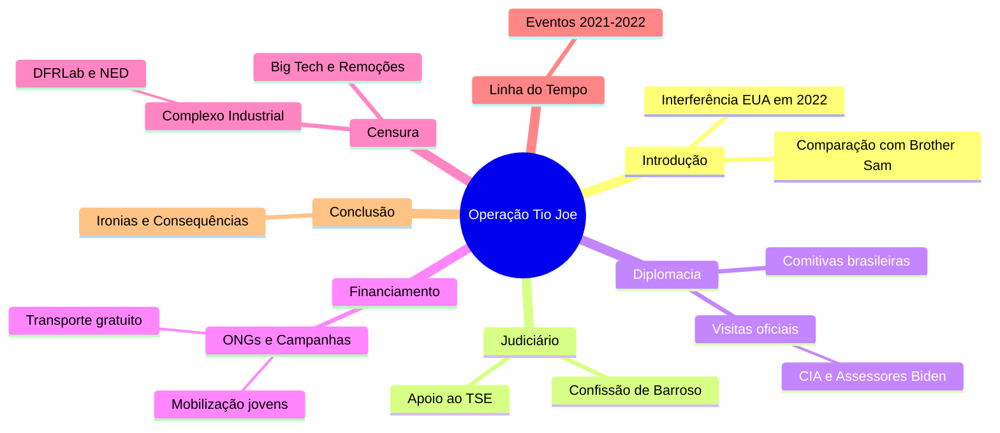

# Complexo Industrial da Censura no Brasil  

## Participação no I Fórum da Liberdade de Expressão de Westminster  
- 🗣️ Evento reuniu jornalistas, intelectuais e ativistas para debater censura  
- 🌍 Manifesto de 140 signatários denunciou violações à liberdade de expressão  

## Intercâmbio Internacional de Estratégias de Censura  
- 🔄 Países ocidentais, como EUA, Canadá, Irlanda e Austrália, trocam práticas censórias  
- 🇧🇷 Brasil é exemplo e peça-chave no Complexo Industrial da Censura (CIC)  

## Definição e Origem do Complexo Industrial da Censura (CIC)  
- 📁 Revelação dos Twitter Files expôs envolvimento de agências governamentais na moderação de conteúdo  
- 🕵️‍♂️ Agências como CIA e FBI influenciam diretamente a supressão de informações  

## Casos Notórios de Censura: O Laptop de Hunter Biden  
- 🖥️ Twitter bloqueou reportagem do New York Post sobre Hunter Biden antes das eleições de 2020  
- 📞 FBI manteve comunicação direta com executivos do Twitter para controlar narrativa  

## Expansão da Rede de Controle e Monitoramento  
- 🌐 Colaboração entre governos, ONGs, empresas de tecnologia e instituições acadêmicas  
- 🤖 Uso combinado de manipulação psicológica e inteligência artificial para silenciar vozes dissidentes  

## Influência do Judiciário Brasileiro no CIC  
- ⚖️ TSE e STF lideram políticas de censura no Brasil  
- 🔗 Rede complexa envolvendo os três poderes, ONGs, imprensa e militantes digitais  

## Histórico e Estruturação da Censura no Brasil  
- 📅 Início em 2017 com reuniões secretas do TSE para combater "desinformação" nas eleições  
- 🛡️ Criação do CIEDDE para enfrentamento da desinformação e defesa da democracia  

## Principais Organizações e Laboratórios Envolvidos  
- 🏛️ DFRLab, Information Futures Lab, Meedan e NetLab atuam na censura e verificação de fatos  
- 📰 Uso de relatórios para justificar perseguições políticas e censura judicial  

## Financiamento da Censura no Brasil  
- 💰 Fundações internacionais como Open Society, Ford Foundation e OAK Foundation financiam iniciativas  
- 🛑 Organizações como Sleeping Giants Brazil e Instituto Vero pressionam contra mídia conservadora  

## Vitórias e Resistência Contra a Censura  
- ✊ Exposição do judiciário brasileiro via Twitter Files Brasil causou impacto internacional  
- 📜 Relatórios e cartas de parlamentares dos EUA denunciaram perseguição política no Brasil  
- 🚫 Fechamento do Observatório da Internet de Stanford, ligado à censura durante a pandemia e eleições  

## Desafios e Perspectivas Futuras  
- 🔍 Aumento da conscientização global sobre ameaças à liberdade de expressão  
- 🔥 Resistência crescente contra ataques do Complexo Industrial da Censura  
- 🌱 Necessidade de fortalecer cultura em prol da liberdade de expressão, além do viés político

Fonte: [ainvestigacao](https://www.ainvestigacao.com/p/operacao-tio-joe-a-influencia-dos)

# Complexo de Censura

Aplicação web interativa (usando tecnologias como React para frontend, Node.js para backend e MongoDB para banco de dados) que visualize e gerencie uma linha do tempo da censura no Brasil, com base nas seguintes informações consolidadas de discussões históricas e recentes:

## Estrutura Geral da Aplicação:

  - Interface principal: Uma timeline interativa (usando bibliotecas como Vis.js ou TimelineJS) dividida em períodos (Colonial até Atual), com filtros por ano, tipo de censura (judicial, midiática, eleitoral) e alvos (conservadores, jornalistas de direita, bolsonaristas).
  - Funcionalidades: Busca por eventos, adição de novos eventos por usuários moderados, exportação para PDF/CSV, e integração com APIs de redes sociais para atualizações em tempo real (ex.: X/Twitter via API pública).
  - Segurança: Autenticação de usuários, moderação de conteúdo para evitar fake news, e conformidade com leis de privacidade (LGPD).

## Conteúdo Baseado em Dados Fornecidos:

Períodos Históricos: Inclua eventos desde o período colonial (1500–1822: proibições pela Inquisição), imperial (1822–1889: repressão a movimentos), República Velha (1889–1930: leis de imprensa), Era Vargas (1930–1945: DIP e censura intensa), Ditadura Militar (1964–1985: AI-5 e repressão), e pós-1985 (democracia com censuras judiciais).
Foco em Eventos Recentes (2019–2025): Agrupe ações judiciais do STF/TSE (principalmente Alexandre de Moraes) contra conservadores nas redes:
  - 2019: Inquérito das Fake News; censura à Crusoé e O Antagonista.
  - 2020: Banimento do Terça Livre; autoexílio de Allan dos Santos.
  - 2021: Bloqueios de contas de bolsonaristas; censura a documentários.
  - 2022: Suspensão do Telegram; censura eleitoral a questionamentos sobre urnas.
  - 2023: Ameaças a plataformas; censuras a reportagens críticas.
  - 2024: Suspensão do X (Twitter); censura a paródias e revistas.
  - 2025: Bloqueio da Revista Timeline; decisões do STF obrigando remoção de conteúdos sem ordem prévia.

Fontes: Integre dados de sites independentes como Gazeta do Povo, Revista Oeste, Cláudio Dantas, The Investor, Hora Brasília e NYT (para equilíbrio), evitando fontes financiadas pelo governo.

## Referências

- [twitterfilesbrazil](https://www.twitterfilesbrazil.com/)
- [gazetadopovo](https://www.gazetadopovo.com.br/busca/?q=Twitter+Files)
- [TwitterFilesBrazil](https://x.com/search?q=%23TwitterFilesBrazil&src=hashtag_click)
- [TwitterFilesBrasil](https://x.com/search?q=%23TwitterFilesBrasil&src=hashtag_click)
- [TwitterFiles](https://x.com/search?q=%23TwitterFiles&src=hashtag_click)

## Mais Fontes 

- [#TwitterFilesBrazil](https://twitter.com/hashtag/TwitterFilesBrazil?src=hashtag_click)
- [twitterfilesbrazil3-EN](./twitterfilesbrazil3.md)
- [twitterfilesbrazil3-ptBR](./twitterfilesbrazil3-ptBR.md)
- [interference-in-the-2022-elections-in-brazil](./interference-in-the-2022-elections-in-brazil.md)
- [Twitter Files Brasil 2 - O influenciador usa de sua influência](https://twitter.com/EliVieiraJr/status/1778175188678369703)
- [Executivo tentou promover encontro entre Felipe Neto e chefe de segurança](https://www.gazetadopovo.com.br/ideias/twitter-files-brasil-executivo-tentou-promover-encontro-entre-felipe-neto-e-chefe-de-seguranca/)
- [O governo brasileiro quer censurar as teorias da conspiração e ainda assim aqui está, espalhando teorias da conspiração](https://twitter.com/shellenberger/status/1777793959571411365)
- [“Foi a gota d’água”, diz Musk sobre ordens de Moraes envolvendo o Twitter](https://www.gazetadopovo.com.br/mundo/foi-a-gota-dagua-diz-musk-sobre-ordens-de-moraes-envolvendo-o-twitter/)
- [‘Atropelo constitucional’ pode anular inquéritos de Moraes, dizem advogados](https://agoranoticiasbrasil.com.br/2024/02/atropelo-constitucional-pode-anular-inqueritos-de-moraes-dizem-advogados/)
- [Le Brésil au bord de la dictature après les demandes abusives du juge Moraes](https://twitter.com/france_soir/status/1778394075692978343)
- ["Twitter Files - Brazil" expõe censura e "repressão abrangente" nas redes | DDF EXTRA](https://www.youtube.com/watch?v=IUDttlpxLCw)
- [um-guia-sobre-a-censura-e-a-perseguicao-contra-a-direita-no-judiciario-brasileiro](https://www.gazetadopovo.com.br/vida-e-cidadania/um-guia-sobre-a-censura-e-a-perseguicao-contra-a-direita-no-judiciario-brasileiro/)

## Notícias

- [Twitter Files Brazil: ou como “derrotamos o bolsonarismo”](https://www.gazetadopovo.com.br/vozes/flavio-gordon/twitter-files-brazil-como-derrotamos-o-bolsonarismo/?ref=busca)
- [Eduardo Bolsonaro quer audiência na Câmara para debater o “Twitter files”](https://www.gazetadopovo.com.br/republica/eduardo-bolsonaro-quer-audiencia-na-camara-para-debater-o-twitter-files/?ref=busca)
- [Os “Twitter Files” e a liberdade de expressão agredida](https://www.gazetadopovo.com.br/opiniao/editoriais/os-twitter-files-e-a-liberdade-de-expressao-agredida/?ref=busca)
- [“Vamos! Eu próprio hei de logo a verdade saber com meus olhos.” (Homero, Odisseia, VI, 126)“É provável que a equipe do Twitter Brasil seja ...](https://www.gazetadopovo.com.br/vozes/flavio-gordon/twitter-files-brazil/?ref=busca)
- [lávio Dino nega pedido em favor dos jornalistas do Twitter Files](https://www.gazetadopovo.com.br/vida-e-cidadania/flavio-dino-nega-pedido-em-favor-dos-jornalistas-do-twitter-files/?ref=busca)
- [Infelizmente, os Twitter Files Brazil estão mobilizando muito mais as emoções do que os cérebros da direita brasileira. Apareceu um bilionário gringo de direita ...](https://www.gazetadopovo.com.br/vozes/bruna-frascolla/algumas-notas-para-pensar-o-caso-twitter-files/?ref=busca)
- [Twitter Files revelam bastidores da censura e prometem impactar decisões políticas](https://www.gazetadopovo.com.br/vida-e-cidadania/twitter-files-revelam-bastidores-censura-impactam-decisoes-politicas/?ref=busca)
- [Apresentador da estatal TV Brasil chama jornalista do Twitter Files de “vagabundo”](https://www.gazetadopovo.com.br/republica/apresentador-da-estatal-tv-brasil-chama-jornalista-do-twitter-files-de-vagabundo/?ref=busca)
- [posição busca institucionalizar denúncias do Twitter Files Brasil no Legislativo](https://www.gazetadopovo.com.br/republica/oposicao-busca-institucionalizar-denuncias-do-twitter-files-no-legislativo/?ref=busca)
- ["Twitter Files Brazil" reafirmam excessos do TSE e outras cortes](https://www.gazetadopovo.com.br/opiniao/editoriais/twitter-files-brazil-excessos-tse-stf/?ref=busca)
- [Jornalista dos Twitter Files denuncia Jorge Messias por abuso de poder na OEA](https://www.gazetadopovo.com.br/ideias/jornalista-dos-twitter-files-denuncia-jorge-messias-por-abuso-de-poder-na-oea/?ref=busca)
- [AGU cita “indícios de crime” e aciona STF contra divulgação do Twitter Files Brasil no X](https://www.gazetadopovo.com.br/republica/agu-cita-indicios-de-crime-e-aciona-stf-contra-twitter-files-brasil-no-x/?ref=busca)
- [Oposição aciona PGR e ANPD sobre denúncias feitas pelo Twitter Files Brasil](https://www.gazetadopovo.com.br/republica/oposicao-aciona-pgr-e-anpd-sobre-denuncias-do-twitter-files-brasil/?ref=busca)
- [Soros e governo Biden estão por trás de teorias da conspiração sobre Twitter Files Brasil](https://www.gazetadopovo.com.br/ideias/soros-e-governo-biden-estao-por-tras-de-teorias-da-conspiracao-sobre-twitter-files-brasil/?ref=busca)
- [Musk vai falar na Câmara dos EUA sobre Twitter Files Brasil; deputados brasileiros devem acompanhar](https://www.gazetadopovo.com.br/mundo/musk-vai-falar-na-camara-dos-eua-sobre-twitter-files-brasil-deputados-brasileiros-devem-acompanhar/?ref=busca)
- [Comissão da Câmara aprova convite a Elon Musk para audiência sobre Twitter Files Brazil](https://www.gazetadopovo.com.br/republica/comissao-da-camara-aprova-convite-a-elon-musk-para-audiencia-sobre-twitter-files-brazil/?ref=busca)
- [Jornalista dos Twitter Files Brasil prestará depoimento na Câmara dos EUA na terça (7)](https://www.gazetadopovo.com.br/mundo/jornalista-dos-twitter-files-brasil-prestara-depoimento-na-camara-dos-eua-na-terca-7/?ref=busca)
- [Twitter files: o que os arquivos mostram sobre o Brasil](https://www.gazetadopovo.com.br/republica/twitter-files-brasil-documentos/?ref=busca)
- [Empresária citada no Twitter Files diz que coligação de Lula fez fake news](https://www.gazetadopovo.com.br/republica/empresaria-alvo-moraes-zanin-fake-news-postagem-redes-sociais/?ref=busca)
- [Jornalista do Twitter Files conta como Musk forneceu dados sobre tentativas de censura do TSE](https://www.gazetadopovo.com.br/republica/jornalista-do-twitter-files-conta-como-musk-forneceu-dados-sobre-o-caso/?ref=busca)
- [Líder da oposição no Senado volta a defender PEC para proteção de jornalistas após Twitter Files](https://www.gazetadopovo.com.br/republica/lider-da-oposicao-no-senado-volta-a-defender-pec-para-protecao-de-jornalistas-apos-twitter-files/?ref=busca)
- [Novo critica Barroso por atribuir caso do Twitter Files à “articulação da extrema-direita”](https://www.gazetadopovo.com.br/republica/novo-critica-barroso-por-atribuir-caso-do-twitter-files-a-articulacao-da-extrema-direita/?ref=busca)
- [Advogado aciona STF para impedir investigação de jornalistas do Twitter Files](https://www.gazetadopovo.com.br/republica/advogado-aciona-stf-para-impedir-investigacao-de-jornalistas-do-twitter-files/?ref=busca)
- [Twitter Files denunciam proteção a Biden em 2020; Musk manifesta “preocupação” com eleições no Brasil](https://www.gazetadopovo.com.br/mundo/twitter-files-denunciam-protecao-a-biden-em-2020-musk-manifesta-preocupacao-com-eleicoes-no-brasil/?ref=busca)
- [Eduardo Bolsonaro marca “super live” com o pai para discutir “Twitter Files” e eleições](https://www.gazetadopovo.com.br/republica/eduardo-bolsonaro-super-live-pai-discutir-twitter-files-eleicoes/?ref=busca)
- [Novas revelações do Twitter Files. Câmara mantém prisão de deputado. Congresso e STF vão debater redes sociais](https://www.gazetadopovo.com.br/opiniao/bom-dia/novas-revelacoes-twitter-files/?ref=busca)
- [Oposição quer ouvir Musk na CCJ da Câmara para falar sobre censura, banimento e Twitter Files](https://www.gazetadopovo.com.br/republica/oposicao-quer-ouvir-musk-na-ccj-da-camara-para-falar-sobre-censura-banimento-e-twitter-files/?ref=busca)
- [Twitter Files: Senador ligado aos democratas pediu censura a críticos e adversários](https://www.gazetadopovo.com.br/ideias/twitter-files-senador-ligado-aos-democratas-pediu-censura-a-criticos-e-adversarios/?ref=busca)
- [Twitter Files CIA: agência tentou controlar conteúdo na rede social. Até o Brasil foi afetado](https://www.gazetadopovo.com.br/ideias/twitter-files-cia-agencia-tentou-controlar-conteudo-na-rede-social-ate-o-brasil-foi-afetado/?ref=busca)
- [Os Twitter Files, as “fake news” e a imprensa corrupta](https://www.gazetadopovo.com.br/vozes/flavio-gordon/os-twitter-files-as-fake-news-e-a-imprensa-corrupta/?ref=busca)

## Contas Retidas até Hoje

- [1](https://x.com/AlexandreFiles)
- [2](https://x.com/ZambelliRita_)
- [3](https://x.com/jalinformei/status/1778373331508462015)
- [4](https://x.com/RacismoFree13/status/1776774921345028227)
- [5](https://x.com/FabioTalhari)
- [6](https://x.com/TheIncorrupt_/status/1821707718903677212)
- [7](https://x.com/elevamiami/status/1653397645358972928) 
- [8](https://x.com/misteriouspavao/status/1827739611763740939)
- [9](https://x.com/AdvogadosOacb)
- [10](https://x.com/Mari26910508/status/1781098559619661875)
- [11](https://x.com/defariasoficial/status/1622803325220540416)
- [12](https://x.com/realpfigueiredo)
- [13](https://x.com/Mari26910508/status/1888384989391118573)
- [14](https://x.com/fabio_talhari/status/1807738267485262174)
- [15](https://x.com/PATRlOTAS)
- [16](https://x.com/DaviSacer)
- [17](https://x.com/adriana75171/status/1825608715824955397)
- [18](https://x.com/marcosdoval)
- [19](https://x.com/EdwardG0422/status/1669436691327733769)
- [20](https://x.com/adriana75171/status/1825626534671265797)
- [21](https://x.com/hipatiaredpill/status/1888390690851246461)
- [22](https://x.com/AlexandreFiles/status/1829979981130416479)
- [23](https://x.com/AlexandreFiles/status/1831063051790958660)
- [21](https://x.com/HalynyMainardes/status/1864113216428589221)
- [22](https://x.com/adriana75171/status/1665721900776009728)
- [23](https://x.com/DemocraciaBR_Ja/status/1750441828497702929)
- [24](https://x.com/TerraBrasilnot/status/1778945263752618392)
- [25](https://x.com/elevamiami/status/1743731131688636514)
- [26](https://x.com/ludmilagrilo)
- [27](https://x.com/DemocraciaBR_Ja/status/1889402119968489673)
- [28](https://x.com/esquerdanaweb)
- [29](https://x.com/lavemowill/status/1730204160665014365)
- [30](https://x.com/Saray_sandrac/status/1770101019306852763)
- [31](https://x.com/CanalHipocritas)
- [32](https://x.com/SpaceLiberdade)