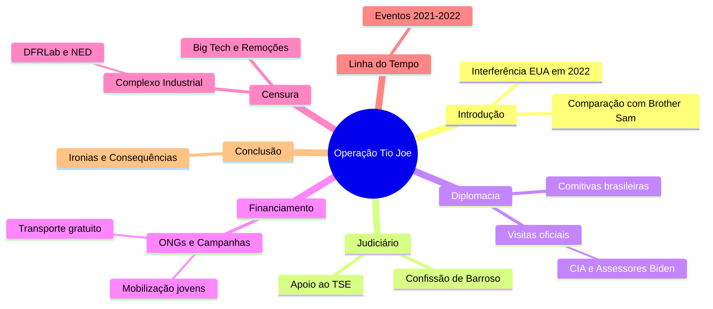

# Complexo Industrial da Censura no Brasil  

## Participação no I Fórum da Liberdade de Expressão de Westminster  
- 🗣️ Evento reuniu jornalistas, intelectuais e ativistas para debater censura  
- 🌍 Manifesto de 140 signatários denunciou violações à liberdade de expressão  

## Intercâmbio Internacional de Estratégias de Censura  
- 🔄 Países ocidentais, como EUA, Canadá, Irlanda e Austrália, trocam práticas censórias  
- 🇧🇷 Brasil é exemplo e peça-chave no Complexo Industrial da Censura (CIC)  

## Definição e Origem do Complexo Industrial da Censura (CIC)  
- 📁 Revelação dos Twitter Files expôs envolvimento de agências governamentais na moderação de conteúdo  
- 🕵️‍♂️ Agências como CIA e FBI influenciam diretamente a supressão de informações  

## Casos Notórios de Censura: O Laptop de Hunter Biden  
- 🖥️ Twitter bloqueou reportagem do New York Post sobre Hunter Biden antes das eleições de 2020  
- 📞 FBI manteve comunicação direta com executivos do Twitter para controlar narrativa  

## Expansão da Rede de Controle e Monitoramento  
- 🌐 Colaboração entre governos, ONGs, empresas de tecnologia e instituições acadêmicas  
- 🤖 Uso combinado de manipulação psicológica e inteligência artificial para silenciar vozes dissidentes  

## Influência do Judiciário Brasileiro no CIC  
- ⚖️ TSE e STF lideram políticas de censura no Brasil  
- 🔗 Rede complexa envolvendo os três poderes, ONGs, imprensa e militantes digitais  

## Histórico e Estruturação da Censura no Brasil  
- 📅 Início em 2017 com reuniões secretas do TSE para combater "desinformação" nas eleições  
- 🛡️ Criação do CIEDDE para enfrentamento da desinformação e defesa da democracia  

## Principais Organizações e Laboratórios Envolvidos  
- 🏛️ DFRLab, Information Futures Lab, Meedan e NetLab atuam na censura e verificação de fatos  
- 📰 Uso de relatórios para justificar perseguições políticas e censura judicial  

## Financiamento da Censura no Brasil  
- 💰 Fundações internacionais como Open Society, Ford Foundation e OAK Foundation financiam iniciativas  
- 🛑 Organizações como Sleeping Giants Brazil e Instituto Vero pressionam contra mídia conservadora  

## Vitórias e Resistência Contra a Censura  
- ✊ Exposição do judiciário brasileiro via Twitter Files Brasil causou impacto internacional  
- 📜 Relatórios e cartas de parlamentares dos EUA denunciaram perseguição política no Brasil  
- 🚫 Fechamento do Observatório da Internet de Stanford, ligado à censura durante a pandemia e eleições  

## Desafios e Perspectivas Futuras  
- 🔍 Aumento da conscientização global sobre ameaças à liberdade de expressão  
- 🔥 Resistência crescente contra ataques do Complexo Industrial da Censura  
- 🌱 Necessidade de fortalecer cultura em prol da liberdade de expressão, além do viés político

Fonte: [ainvestigacao](https://www.ainvestigacao.com/p/operacao-tio-joe-a-influencia-dos)

# Complexo de Censura

Aplicação web interativa (usando tecnologias como React para frontend, Node.js para backend e MongoDB para banco de dados) que visualize e gerencie uma linha do tempo da censura no Brasil, com base nas seguintes informações consolidadas de discussões históricas e recentes:

## Estrutura Geral da Aplicação:

  - Interface principal: Uma timeline interativa (usando bibliotecas como Vis.js ou TimelineJS) dividida em períodos (Colonial até Atual), com filtros por ano, tipo de censura (judicial, midiática, eleitoral) e alvos (conservadores, jornalistas de direita, bolsonaristas).
  - Funcionalidades: Busca por eventos, adição de novos eventos por usuários moderados, exportação para PDF/CSV, e integração com APIs de redes sociais para atualizações em tempo real (ex.: X/Twitter via API pública).
  - Segurança: Autenticação de usuários, moderação de conteúdo para evitar fake news, e conformidade com leis de privacidade (LGPD).

## Conteúdo Baseado em Dados Fornecidos:

Períodos Históricos: Inclua eventos desde o período colonial (1500–1822: proibições pela Inquisição), imperial (1822–1889: repressão a movimentos), República Velha (1889–1930: leis de imprensa), Era Vargas (1930–1945: DIP e censura intensa), Ditadura Militar (1964–1985: AI-5 e repressão), e pós-1985 (democracia com censuras judiciais).
Foco em Eventos Recentes (2019–2025): Agrupe ações judiciais do STF/TSE (principalmente Alexandre de Moraes) contra conservadores nas redes:
  - 2019: Inquérito das Fake News; censura à Crusoé e O Antagonista.
  - 2020: Banimento do Terça Livre; autoexílio de Allan dos Santos.
  - 2021: Bloqueios de contas de bolsonaristas; censura a documentários.
  - 2022: Suspensão do Telegram; censura eleitoral a questionamentos sobre urnas.
  - 2023: Ameaças a plataformas; censuras a reportagens críticas.
  - 2024: Suspensão do X (Twitter); censura a paródias e revistas.
  - 2025: Bloqueio da Revista Timeline; decisões do STF obrigando remoção de conteúdos sem ordem prévia.

## Desmonetização de Canais Bolsonaristas

A desmonetização de canais bolsonaristas no YouTube tem ocorrido tanto por decisão da própria plataforma quanto por determinação do Tribunal Superior Eleitoral (TSE).

1. Houve casos em que o YouTube desmonetizou canais bolsonaristas por decisão interna, sem ordem judicial. Por exemplo, o canal do blogueiro bolsonarista Bernardo Kuster, com cerca de 924 mil inscritos, foi desmonetizado pelo YouTube após revisão do conteúdo que violava as políticas da plataforma. Essa decisão não foi motivada por ordem judicial, mas pela avaliação da empresa após investigação do STF por disseminação de Fake News[1].

2. Por outro lado, o TSE ordenou a desmonetização de quatro canais bolsonaristas: Brasil Paralelo, Foco do Brasil, Folha Política e Dr. News, em contexto da eleição de 2022. A decisão foi tomada para impedir a monetização e impulsionamento de conteúdos falsos e desinformação política contra o então candidato Luiz Inácio Lula da Silva. Essa medida também incluiu a suspensão de um documentário sobre a facada em Bolsonaro até após o segundo turno eleitoral[2][3][5][6][7][8].

3. A ação do TSE visou combater o chamado “ecossistema de desinformação” que favoreceriam a campanha de Jair Bolsonaro, com múltiplas contas e perfis investigados por disseminação coordenada de notícias falsas. A desmonetização também visou impedir o financiamento e propagação dessas mensagens, redirecionando valores a contas judiciais[3][5].

4. Além disso, canais bolsonaristas excluíram milhares de vídeos falsos pouco antes das eleições, e alguns deles já estavam desmonetizados ou sob investigação por ataques ao sistema democrático e ao STF[4].

Em resumo, a **desmonetização de canais bolsonaristas** tem ocorrido simultaneamente por iniciativa do YouTube, por violação das políticas da plataforma, e por decisões judiciais do TSE, que atuou para conter a propagação de fake news e desinformação eleitoral[1][2][3][5].

[1] https://blogs.oglobo.globo.com/sonar-a-escuta-das-redes/post/google-determinou-desmonetizacao-de-canal-de-blogueiro-bolsonarista-investigado-pelo-stf.html
[2] https://noticias.uol.com.br/eleicoes/2022/10/20/tse-mantem-brasil-paralelo-desmonetizado-e-veda-video-da-facada-ate-eleicao.htm
[3] https://www.youtube.com/watch?v=g32DNWXZIv0
[4] https://www.cartacapital.com.br/politica/em-uma-semana-bolsonaristas-excluem-pelo-menos-5-mil-videos-no-youtube/
[5] https://noticias.uol.com.br/ultimas-noticias/agencia-estado/2022/10/18/tse-manda-desmonetizar-canais-bolsonaristas-e-cobra-explicacao-de-carlos.htm
[6] https://www.cnnbrasil.com.br/politica/tse-intima-carlos-bolsonaro-e-suspende-monetizacao-de-canais-de-direita-no-youtube/
[7] https://www.nexojornal.com.br/extra/2022/10/18/contra-fake-news-tse-desmonetiza-canais-bolsonaristas
[8] https://www.tse.jus.br/comunicacao/noticias/2022/Outubro/tse-desmonetiza-quatro-canais-e-suspende-divulgacao-de-documentario

Fontes: Dados de sites independentes como Gazeta do Povo, Revista Oeste, Cláudio Dantas, The Investor, Hora Brasília e NYT (para equilíbrio), evitando fontes financiadas pelo governo.

## Referências

- [twitterfilesbrazil](https://www.twitterfilesbrazil.com/)
- [gazetadopovo](https://www.gazetadopovo.com.br/busca/?q=Twitter+Files)
- [TwitterFilesBrazil](https://x.com/search?q=%23TwitterFilesBrazil&src=hashtag_click)
- [TwitterFilesBrasil](https://x.com/search?q=%23TwitterFilesBrasil&src=hashtag_click)
- [TwitterFiles](https://x.com/search?q=%23TwitterFiles&src=hashtag_click)

## Fontes 

- [twitterfilesbrazil3-EN](./twitterfilesbrazil3.md)
- [twitterfilesbrazil3-ptBR](./twitterfilesbrazil3-ptBR.md)
- [interference-in-the-2022-elections-in-brazil](./interference-in-the-2022-elections-in-brazil.md)
- [Twitter Files Brasil 2 - O influenciador usa de sua influência](https://twitter.com/EliVieiraJr/status/1778175188678369703)
- [Executivo tentou promover encontro entre Felipe Neto e chefe de segurança](https://www.gazetadopovo.com.br/ideias/twitter-files-brasil-executivo-tentou-promover-encontro-entre-felipe-neto-e-chefe-de-seguranca/)
- [O governo brasileiro quer censurar as teorias da conspiração e ainda assim aqui está, espalhando teorias da conspiração](https://twitter.com/shellenberger/status/1777793959571411365)
- [“Foi a gota d’água”, diz Musk sobre ordens de Moraes envolvendo o Twitter](https://www.gazetadopovo.com.br/mundo/foi-a-gota-dagua-diz-musk-sobre-ordens-de-moraes-envolvendo-o-twitter/)
- [‘Atropelo constitucional’ pode anular inquéritos de Moraes, dizem advogados](https://agoranoticiasbrasil.com.br/2024/02/atropelo-constitucional-pode-anular-inqueritos-de-moraes-dizem-advogados/)
- [Le Brésil au bord de la dictature après les demandes abusives du juge Moraes](https://twitter.com/france_soir/status/1778394075692978343)
- ["Twitter Files - Brazil" expõe censura e "repressão abrangente" nas redes | DDF EXTRA](https://www.youtube.com/watch?v=IUDttlpxLCw)
- [um-guia-sobre-a-censura-e-a-perseguicao-contra-a-direita-no-judiciario-brasileiro](https://www.gazetadopovo.com.br/vida-e-cidadania/um-guia-sobre-a-censura-e-a-perseguicao-contra-a-direita-no-judiciario-brasileiro/)

## Notícias

- [Twitter Files Brazil: ou como “derrotamos o bolsonarismo”](https://www.gazetadopovo.com.br/vozes/flavio-gordon/twitter-files-brazil-como-derrotamos-o-bolsonarismo/?ref=busca)
- [Eduardo Bolsonaro quer audiência na Câmara para debater o “Twitter files”](https://www.gazetadopovo.com.br/republica/eduardo-bolsonaro-quer-audiencia-na-camara-para-debater-o-twitter-files/?ref=busca)
- [Os “Twitter Files” e a liberdade de expressão agredida](https://www.gazetadopovo.com.br/opiniao/editoriais/os-twitter-files-e-a-liberdade-de-expressao-agredida/?ref=busca)
- [“Vamos! Eu próprio hei de logo a verdade saber com meus olhos.” (Homero, Odisseia, VI, 126)“É provável que a equipe do Twitter Brasil seja ...](https://www.gazetadopovo.com.br/vozes/flavio-gordon/twitter-files-brazil/?ref=busca)
- [lávio Dino nega pedido em favor dos jornalistas do Twitter Files](https://www.gazetadopovo.com.br/vida-e-cidadania/flavio-dino-nega-pedido-em-favor-dos-jornalistas-do-twitter-files/?ref=busca)
- [Infelizmente, os Twitter Files Brazil estão mobilizando muito mais as emoções do que os cérebros da direita brasileira. Apareceu um bilionário gringo de direita ...](https://www.gazetadopovo.com.br/vozes/bruna-frascolla/algumas-notas-para-pensar-o-caso-twitter-files/?ref=busca)
- [Twitter Files revelam bastidores da censura e prometem impactar decisões políticas](https://www.gazetadopovo.com.br/vida-e-cidadania/twitter-files-revelam-bastidores-censura-impactam-decisoes-politicas/?ref=busca)
- [Apresentador da estatal TV Brasil chama jornalista do Twitter Files de “vagabundo”](https://www.gazetadopovo.com.br/republica/apresentador-da-estatal-tv-brasil-chama-jornalista-do-twitter-files-de-vagabundo/?ref=busca)
- [posição busca institucionalizar denúncias do Twitter Files Brasil no Legislativo](https://www.gazetadopovo.com.br/republica/oposicao-busca-institucionalizar-denuncias-do-twitter-files-no-legislativo/?ref=busca)
- ["Twitter Files Brazil" reafirmam excessos do TSE e outras cortes](https://www.gazetadopovo.com.br/opiniao/editoriais/twitter-files-brazil-excessos-tse-stf/?ref=busca)
- [Jornalista dos Twitter Files denuncia Jorge Messias por abuso de poder na OEA](https://www.gazetadopovo.com.br/ideias/jornalista-dos-twitter-files-denuncia-jorge-messias-por-abuso-de-poder-na-oea/?ref=busca)
- [AGU cita “indícios de crime” e aciona STF contra divulgação do Twitter Files Brasil no X](https://www.gazetadopovo.com.br/republica/agu-cita-indicios-de-crime-e-aciona-stf-contra-twitter-files-brasil-no-x/?ref=busca)
- [Oposição aciona PGR e ANPD sobre denúncias feitas pelo Twitter Files Brasil](https://www.gazetadopovo.com.br/republica/oposicao-aciona-pgr-e-anpd-sobre-denuncias-do-twitter-files-brasil/?ref=busca)
- [Soros e governo Biden estão por trás de teorias da conspiração sobre Twitter Files Brasil](https://www.gazetadopovo.com.br/ideias/soros-e-governo-biden-estao-por-tras-de-teorias-da-conspiracao-sobre-twitter-files-brasil/?ref=busca)
- [Musk vai falar na Câmara dos EUA sobre Twitter Files Brasil; deputados brasileiros devem acompanhar](https://www.gazetadopovo.com.br/mundo/musk-vai-falar-na-camara-dos-eua-sobre-twitter-files-brasil-deputados-brasileiros-devem-acompanhar/?ref=busca)
- [Comissão da Câmara aprova convite a Elon Musk para audiência sobre Twitter Files Brazil](https://www.gazetadopovo.com.br/republica/comissao-da-camara-aprova-convite-a-elon-musk-para-audiencia-sobre-twitter-files-brazil/?ref=busca)
- [Jornalista dos Twitter Files Brasil prestará depoimento na Câmara dos EUA na terça (7)](https://www.gazetadopovo.com.br/mundo/jornalista-dos-twitter-files-brasil-prestara-depoimento-na-camara-dos-eua-na-terca-7/?ref=busca)
- [Twitter files: o que os arquivos mostram sobre o Brasil](https://www.gazetadopovo.com.br/republica/twitter-files-brasil-documentos/?ref=busca)
- [Empresária citada no Twitter Files diz que coligação de Lula fez fake news](https://www.gazetadopovo.com.br/republica/empresaria-alvo-moraes-zanin-fake-news-postagem-redes-sociais/?ref=busca)
- [Jornalista do Twitter Files conta como Musk forneceu dados sobre tentativas de censura do TSE](https://www.gazetadopovo.com.br/republica/jornalista-do-twitter-files-conta-como-musk-forneceu-dados-sobre-o-caso/?ref=busca)
- [Líder da oposição no Senado volta a defender PEC para proteção de jornalistas após Twitter Files](https://www.gazetadopovo.com.br/republica/lider-da-oposicao-no-senado-volta-a-defender-pec-para-protecao-de-jornalistas-apos-twitter-files/?ref=busca)
- [Novo critica Barroso por atribuir caso do Twitter Files à “articulação da extrema-direita”](https://www.gazetadopovo.com.br/republica/novo-critica-barroso-por-atribuir-caso-do-twitter-files-a-articulacao-da-extrema-direita/?ref=busca)
- [Advogado aciona STF para impedir investigação de jornalistas do Twitter Files](https://www.gazetadopovo.com.br/republica/advogado-aciona-stf-para-impedir-investigacao-de-jornalistas-do-twitter-files/?ref=busca)
- [Twitter Files denunciam proteção a Biden em 2020; Musk manifesta “preocupação” com eleições no Brasil](https://www.gazetadopovo.com.br/mundo/twitter-files-denunciam-protecao-a-biden-em-2020-musk-manifesta-preocupacao-com-eleicoes-no-brasil/?ref=busca)
- [Eduardo Bolsonaro marca “super live” com o pai para discutir “Twitter Files” e eleições](https://www.gazetadopovo.com.br/republica/eduardo-bolsonaro-super-live-pai-discutir-twitter-files-eleicoes/?ref=busca)
- [Novas revelações do Twitter Files. Câmara mantém prisão de deputado. Congresso e STF vão debater redes sociais](https://www.gazetadopovo.com.br/opiniao/bom-dia/novas-revelacoes-twitter-files/?ref=busca)
- [Oposição quer ouvir Musk na CCJ da Câmara para falar sobre censura, banimento e Twitter Files](https://www.gazetadopovo.com.br/republica/oposicao-quer-ouvir-musk-na-ccj-da-camara-para-falar-sobre-censura-banimento-e-twitter-files/?ref=busca)
- [Twitter Files: Senador ligado aos democratas pediu censura a críticos e adversários](https://www.gazetadopovo.com.br/ideias/twitter-files-senador-ligado-aos-democratas-pediu-censura-a-criticos-e-adversarios/?ref=busca)
- [Twitter Files CIA: agência tentou controlar conteúdo na rede social. Até o Brasil foi afetado](https://www.gazetadopovo.com.br/ideias/twitter-files-cia-agencia-tentou-controlar-conteudo-na-rede-social-ate-o-brasil-foi-afetado/?ref=busca)
- [Os Twitter Files, as “fake news” e a imprensa corrupta](https://www.gazetadopovo.com.br/vozes/flavio-gordon/os-twitter-files-as-fake-news-e-a-imprensa-corrupta/?ref=busca)

## Contas Retidas até Hoje

- [1](https://x.com/AlexandreFiles)
- [2](https://x.com/ZambelliRita_)
- [3](https://x.com/jalinformei/status/1778373331508462015)
- [4](https://x.com/RacismoFree13/status/1776774921345028227)
- [5](https://x.com/FabioTalhari)
- [6](https://x.com/TheIncorrupt_/status/1821707718903677212)
- [7](https://x.com/elevamiami/status/1653397645358972928) 
- [8](https://x.com/misteriouspavao/status/1827739611763740939)
- [9](https://x.com/AdvogadosOacb)
- [10](https://x.com/Mari26910508/status/1781098559619661875)
- [11](https://x.com/defariasoficial/status/1622803325220540416)
- [12](https://x.com/realpfigueiredo)
- [13](https://x.com/Mari26910508/status/1888384989391118573)
- [14](https://x.com/fabio_talhari/status/1807738267485262174)
- [15](https://x.com/PATRlOTAS)
- [16](https://x.com/DaviSacer)
- [17](https://x.com/adriana75171/status/1825608715824955397)
- [18](https://x.com/marcosdoval)
- [19](https://x.com/EdwardG0422/status/1669436691327733769)
- [20](https://x.com/adriana75171/status/1825626534671265797)
- [21](https://x.com/hipatiaredpill/status/1888390690851246461)
- [22](https://x.com/AlexandreFiles/status/1829979981130416479)
- [23](https://x.com/AlexandreFiles/status/1831063051790958660)
- [21](https://x.com/HalynyMainardes/status/1864113216428589221)
- [22](https://x.com/adriana75171/status/1665721900776009728)
- [23](https://x.com/DemocraciaBR_Ja/status/1750441828497702929)
- [24](https://x.com/TerraBrasilnot/status/1778945263752618392)
- [25](https://x.com/elevamiami/status/1743731131688636514)
- [26](https://x.com/ludmilagrilo)
- [27](https://x.com/DemocraciaBR_Ja/status/1889402119968489673)
- [28](https://x.com/esquerdanaweb)
- [29](https://x.com/lavemowill/status/1730204160665014365)
- [30](https://x.com/Saray_sandrac/status/1770101019306852763)
- [31](https://x.com/CanalHipocritas)
- [32](https://x.com/SpaceLiberdade)

## Compilação de Artigos sobre Twitter Files e Censura no Brasil

Esta compilação reúne artigos publicados pela Gazeta do Povo relacionados aos "Twitter Files", censura nas redes sociais, embates entre Elon Musk e Alexandre de Moraes, e temas correlatos como liberdade de expressão e decisões judiciais. Os links foram extraídos do arquivo fontes.html e organizados em uma lista formatada para facilitar a navegação. Cada item inclui o título da matéria e o link correspondente.

Os artigos estão listados na ordem em que aparecem no documento original, sem agrupamentos temáticos adicionais para preservar a fidelidade. Para mais detalhes, acesse os links diretamente.

### Lista de Artigos

- [Twitter Files Brazil: ou como “derrotamos o bolsonarismo”](https://www.gazetadopovo.com.br/vozes/flavio-gordon/twitter-files-brazil-como-derrotamos-o-bolsonarismo/?ref=busca)
- [Eduardo Bolsonaro quer audiência na Câmara para debater o “Twitter files”](https://www.gazetadopovo.com.br/republica/eduardo-bolsonaro-quer-audiencia-na-camara-para-debater-o-twitter-files/?ref=busca)
- [Os “Twitter Files” e a liberdade de expressão agredida](https://www.gazetadopovo.com.br/opiniao/editoriais/os-twitter-files-e-a-liberdade-de-expressao-agredida/?ref=busca)
- [Twitter Files Brazil](https://www.gazetadopovo.com.br/vozes/flavio-gordon/twitter-files-brazil/?ref=busca)
- [Flávio Dino nega pedido em favor dos jornalistas do Twitter Files](https://www.gazetadopovo.com.br/vida-e-cidadania/flavio-dino-nega-pedido-em-favor-dos-jornalistas-do-twitter-files/?ref=busca)
- [Algumas notas para pensar o caso Twitter Files](https://www.gazetadopovo.com.br/vozes/bruna-frascolla/algumas-notas-para-pensar-o-caso-twitter-files/?ref=busca)
- [Twitter Files revelam bastidores da censura e prometem impactar decisões políticas](https://www.gazetadopovo.com.br/vida-e-cidadania/twitter-files-revelam-bastidores-censura-impactam-decisoes-politicas/?ref=busca)
- [Apresentador da estatal TV Brasil chama jornalista do Twitter Files de “vagabundo”](https://www.gazetadopovo.com.br/republica/apresentador-da-estatal-tv-brasil-chama-jornalista-do-twitter-files-de-vagabundo/?ref=busca)
- [Oposição busca institucionalizar denúncias do Twitter Files Brasil no Legislativo](https://www.gazetadopovo.com.br/republica/oposicao-busca-institucionalizar-denuncias-do-twitter-files-no-legislativo/?ref=busca)
- [“Twitter Files Brazil” reafirmam excessos do TSE e outras cortes](https://www.gazetadopovo.com.br/opiniao/editoriais/twitter-files-brazil-excessos-tse-stf/?ref=busca)
- [Jornalista dos Twitter Files denuncia Jorge Messias por abuso de poder na OEA](https://www.gazetadopovo.com.br/ideias/jornalista-dos-twitter-files-denuncia-jorge-messias-por-abuso-de-poder-na-oea/?ref=busca)
- [AGU cita “indícios de crime” e aciona STF contra divulgação do Twitter Files Brasil no X](https://www.gazetadopovo.com.br/republica/agu-cita-indicios-de-crime-e-aciona-stf-contra-twitter-files-brasil-no-x/?ref=busca)
- [Oposição aciona PGR e ANPD sobre denúncias feitas pelo Twitter Files Brasil](https://www.gazetadopovo.com.br/republica/oposicao-aciona-pgr-e-anpd-sobre-denuncias-do-twitter-files-brasil/?ref=busca)
- [Soros e governo Biden estão por trás de teorias da conspiração sobre Twitter Files Brasil](https://www.gazetadopovo.com.br/ideias/soros-e-governo-biden-estao-por-tras-de-teorias-da-conspiracao-sobre-twitter-files-brasil/?ref=busca)
- [Musk vai falar na Câmara dos EUA sobre Twitter Files Brasil; deputados brasileiros devem acompanhar](https://www.gazetadopovo.com.br/mundo/musk-vai-falar-na-camara-dos-eua-sobre-twitter-files-brasil-deputados-brasileiros-devem-acompanhar/?ref=busca)
- [Comissão da Câmara aprova convite a Elon Musk para audiência sobre Twitter Files Brazil](https://www.gazetadopovo.com.br/republica/comissao-da-camara-aprova-convite-a-elon-musk-para-audiencia-sobre-twitter-files-brazil/?ref=busca)
- [Jornalista dos Twitter Files Brasil prestará depoimento na Câmara dos EUA na terça (7)](https://www.gazetadopovo.com.br/mundo/jornalista-dos-twitter-files-brasil-prestara-depoimento-na-camara-dos-eua-na-terca-7/?ref=busca)
- [Twitter files: o que os arquivos mostram sobre o Brasil](https://www.gazetadopovo.com.br/republica/twitter-files-brasil-documentos/?ref=busca)
- [Empresária citada no Twitter Files diz que coligação de Lula fez fake news](https://www.gazetadopovo.com.br/republica/empresaria-alvo-moraes-zanin-fake-news-postagem-redes-sociais/?ref=busca)
- [Jornalista do Twitter Files conta como Musk forneceu dados sobre tentativas de censura do TSE](https://www.gazetadopovo.com.br/republica/jornalista-do-twitter-files-conta-como-musk-forneceu-dados-sobre-o-caso/?ref=busca)
- [Líder da oposição no Senado volta a defender PEC para proteção de jornalistas após Twitter Files](https://www.gazetadopovo.com.br/republica/lider-da-oposicao-no-senado-volta-a-defender-pec-para-protecao-de-jornalistas-apos-twitter-files/?ref=busca)
- [Novo critica Barroso por atribuir caso do Twitter Files à “articulação da extrema-direita”](https://www.gazetadopovo.com.br/republica/novo-critica-barroso-por-atribuir-caso-do-twitter-files-a-articulacao-da-extrema-direita/?ref=busca)
- [Advogado aciona STF para impedir investigação de jornalistas do Twitter Files](https://www.gazetadopovo.com.br/republica/advogado-aciona-stf-para-impedir-investigacao-de-jornalistas-do-twitter-files/?ref=busca)
- [Twitter Files denunciam proteção a Biden em 2020; Musk manifesta “preocupação” com eleições no Brasil](https://www.gazetadopovo.com.br/mundo/twitter-files-denunciam-protecao-a-biden-em-2020-musk-manifesta-preocupacao-com-eleicoes-no-brasil/?ref=busca)
- [Eduardo Bolsonaro marca “super live” com o pai para discutir “Twitter Files” e eleições](https://www.gazetadopovo.com.br/republica/eduardo-bolsonaro-super-live-pai-discutir-twitter-files-eleicoes/?ref=busca)
- [Novas revelações do Twitter Files. Câmara mantém prisão de deputado. Congresso e STF vão debater redes sociais](https://www.gazetadopovo.com.br/opiniao/bom-dia/novas-revelacoes-twitter-files/?ref=busca)
- [Oposição quer ouvir Musk na CCJ da Câmara para falar sobre censura, banimento e Twitter Files](https://www.gazetadopovo.com.br/republica/oposicao-quer-ouvir-musk-na-ccj-da-camara-para-falar-sobre-censura-banimento-e-twitter-files/?ref=busca)
- [Twitter Files: Senador ligado aos democratas pediu censura a críticos e adversários](https://www.gazetadopovo.com.br/ideias/twitter-files-senador-ligado-aos-democratas-pediu-censura-a-criticos-e-adversarios/?ref=busca)
- [Twitter Files CIA: agência tentou controlar conteúdo na rede social. Até o Brasil foi afetado](https://www.gazetadopovo.com.br/ideias/twitter-files-cia-agencia-tentou-controlar-conteudo-na-rede-social-ate-o-brasil-foi-afetado/?ref=busca)
- [Os Twitter Files, as “fake news” e a imprensa corrupta](https://www.gazetadopovo.com.br/vozes/flavio-gordon/os-twitter-files-as-fake-news-e-a-imprensa-corrupta/?ref=busca)
- [“Ao proibir o X, Lula e Moraes se revelaram ditadores”, diz jornalista do Twitter Files](https://www.gazetadopovo.com.br/republica/ao-proibir-o-x-lula-e-moraes-se-revelaram-ditadores-diz-jornalista-do-twitter-files/?ref=busca)
- [Jornalista que investiga Twitter Files no Brasil conta como Musk acusa TSE de violar liberdades](https://www.gazetadopovo.com.br/republica/jornalista-que-investiga-twitter-files-no-brasil-conta-como-musk-acusa-tse-de-violar-liberdades/?ref=busca)
- [Oposição pede informações ao Google e ao X sobre o Twitter Files Brasil](https://www.gazetadopovo.com.br/republica/oposicao-pede-informacoes-ao-google-e-ao-x-sobre-o-twitter-files-brasil/?ref=busca)
- [Twitter Files: demais redes sociais também perseguiram e censuraram conservadores](https://www.gazetadopovo.com.br/ideias/twitter-files-demais-redes-sociais-tambem-perseguiram-e-censuraram-conservadores/?ref=busca)
- [Jornalista do Twitter Files conta como TSE pediu ao X coleta de dados de usuários em massa](https://www.gazetadopovo.com.br/republica/jornalista-do-twitter-files-conta-como-tse-pediu-ao-x-coleta-de-dados-de-usuarios-em-massa/?ref=busca)
- [Jornalistas defendem liberdade de expressão em audiência sobre “Twitter Files Brazil”](https://www.gazetadopovo.com.br/republica/jornalistas-defendem-liberdade-de-expressao-em-audiencia-sobre-twitter-files-brazil/?ref=busca)
- [Ação da AGU no Supremo no caso Twitter Files ameaça liberdade de expressão](https://www.gazetadopovo.com.br/republica/acao-da-agu-no-supremo-no-caso-twitter-files-ameaca-liberdade-de-expressao/?ref=busca)
- [Twitter Files acusam empresa de ajudar Pentágono a fazer propaganda contra inimigos dos EUA](https://www.gazetadopovo.com.br/mundo/twitter-files-pentagono/?ref=busca)
- [Twitter Files: rede social atendia a pedidos do FBI para censurar até piadas](https://www.gazetadopovo.com.br/mundo/twitter-files-rede-social-atendia-a-pedidos-do-fbi-para-censurar-ate-piadas/?ref=busca)
- [Nos EUA, jornalista do Twitter Files acusa STF e TSE de interferir diretamente nas eleições do Brasil](https://www.gazetadopovo.com.br/mundo/nos-eua-jornalista-do-twitter-files-acusa-stf-e-tse-de-interferir-diretamente-nas-eleicoes-do-brasil/?ref=busca)
- [Rodrigo Pacheco é cobrado por ignorar impeachment de Alexandre de Moraes e Twitter Files](https://www.gazetadopovo.com.br/sem-rodeios/rodrigo-pacheco-e-cobrado-por-ignorar-impeachment-de-alexandre-de-moraes-e-twitter-files/?ref=busca)
- [Twitter Files Brasil: executivo tentou promover encontro entre Felipe Neto e chefe de segurança](https://www.gazetadopovo.com.br/ideias/twitter-files-brasil-executivo-tentou-promover-encontro-entre-felipe-neto-e-chefe-de-seguranca/?ref=busca)
- [Twitter Files Brasil: e-mails mostram que busca do TSE por dados privados também afetou personalidades da esquerda](https://www.gazetadopovo.com.br/ideias/twitter-files-brasil-e-mails-mostram-que-busca-do-tse-por-dados-privados-tambem-afetou-personalidades-da-esquerda/?ref=busca)
- [O escândalo “Twitter files” mostra que políticas das Big Techs precisam de transparência](https://www.gazetadopovo.com.br/vozes/cidadania-digital/o-escandalo-twitter-files-mostra-que-politicas-das-big-techs-precisam-de-transparencia/?ref=busca)
- [Escândalo do Twitter Files e alta nos preços dos alimentos podem impulsionar ato pró-Bolsonaro](https://www.gazetadopovo.com.br/republica/twitter-files-e-popularidade-de-lula-podem-impulsionar-ato-pro-bolsonaro/?ref=busca)
- [Pedidos de impeachment contra Moraes devem seguir engavetados no Senado mesmo após Twitter Files](https://www.gazetadopovo.com.br/republica/pedidos-de-impeachment-contra-moraes-devem-seguir-engavetados-no-senado-mesmo-apos-twitter-files/?ref=busca)
- [Com Moro, TSE pode fixar limites. Lula busca crédito por ajuda ao RS. As teorias conspiratórias sobre o Twitter Files](https://www.gazetadopovo.com.br/opiniao/bom-dia/moro-limites-tse/?ref=busca)
- [Projeto de Stanford, agências do governo americano e ONGs atuava como “Minority Report” da internet, revelam Twitter Files](https://www.gazetadopovo.com.br/mundo/projeto-de-stanford-agencias-do-governo-americano-e-ongs-atuavam-como-minority-report-da-internet-revelam-twitter-files/?ref=busca)
- [Twitter Files leva multidão às ruas que segue sem representantes](https://www.gazetadopovo.com.br/ideias/twitter-files-leva-multidao-ruas-segue-sem-representantes/?ref=busca)
- [Abusos de Moraes são expostos por jornalista americano](https://www.gazetadopovo.com.br/sem-rodeios/abusos-de-moraes-sao-expostos-por-jornalista-americano/?ref=busca)
- [Partido Republicano pede reabertura de investigação sobre censura do Twitter](https://www.gazetadopovo.com.br/mundo/partido-republicano-pede-reabertura-de-investigacao-sobre-censura-do-twitter/?ref=busca)
- [“Não foi só Moraes”: Ludmila Grilo expõe nome de juiz que atuou pela censura](https://www.gazetadopovo.com.br/vozes/entrelinhas/nao-foi-so-moraes-ludmila-grilo-expoe-nome-de-juiz-que-atuou-pela-censura/?ref=busca)
- [Deputados denunciam na Europa perseguição política e embate entre Musk e Moraes ganha destaque](https://www.gazetadopovo.com.br/republica/deputados-denunciam-europa-perseguicao-politica-embate-musk-moraes/?ref=busca)
- [Muito além do FBI: censura no Twitter abrangia CIA e outras agências do governo americano](https://www.gazetadopovo.com.br/mundo/muito-alem-do-fbi-censura-no-twitter-abrangia-cia-e-outras-agencias-do-governo-americano/?ref=busca)
- [Deputado divulga lista de assinaturas para CPI sobre censura nas redes](https://www.gazetadopovo.com.br/vozes/entrelinhas/deputado-divulga-lista-de-assinaturas-para-cpi-sobre-censura-nas-redes/?ref=busca)
- [“Maior escândalo do Brasil”, diz Nikolas Ferreira após conversa com Elon Musk](https://www.gazetadopovo.com.br/vozes/entrelinhas/maior-escandalo-do-brasil-diz-nikolas-ferreira-apos-conversa-com-elon-musk/?ref=busca)
- [Comissão da Câmara aprova moção de louvor e aplauso a Elon Musk por revelar censura no Brasil](https://www.gazetadopovo.com.br/republica/comissao-da-camara-aprova-mocao-de-louvor-e-aplauso-a-elon-musk-por-revelar-censura-no-brasil/?ref=busca)
- [Alexandre de Moraes e a investida de Lula contra a liberdade de expressão no Twitter Files](https://www.gazetadopovo.com.br/sem-rodeios/alexandre-de-moraes-e-a-investida-de-lula-contra-a-liberdade-de-expressao-no-twitter-files/?ref=busca)
- [Laboratório pró-censura de Stanford será fechado](https://www.gazetadopovo.com.br/mundo/laboratorio-pro-censura-de-stanford-sera-fechado/?ref=busca)
- [Censura no Brasil pode resultar no impeachment de Alexandre de Moraes?](https://www.gazetadopovo.com.br/vida-e-cidadania/censura-brasil-pode-dar-impeachment-alexandre-moraes/?ref=busca)
- [Musk diz que “ficaria feliz” em depor na Câmara dos Deputados sobre denúncias de censura](https://www.gazetadopovo.com.br/mundo/musk-diz-que-ficaria-feliz-em-depor-na-camara-dos-deputados-sobre-denuncias-de-censura/?ref=busca)
- [“Foi por água abaixo”, diz fundador do Twitter sobre a gestão de Elon Musk, enquanto promove nova rede social](https://www.gazetadopovo.com.br/mundo/breves/foi-por-agua-abaixo-diz-fundador-do-twitter-sobre-a-gestao-de-elon-musk-enquanto-promove-nova-rede-social/?ref=busca)
- [Fraga apresenta projeto para tornar pública ordem judicial que “censura” perfis](https://www.gazetadopovo.com.br/vida-e-cidadania/fraga-apresenta-projeto-para-tornar-publica-ordem-judicial-que-censura-perfis/?ref=busca)
- [Como a troca de farpas entre Musk e Moraes deve repercutir no Congresso](https://www.gazetadopovo.com.br/republica/elon-musk-alexandre-de-moraes-stf-congresso/?ref=busca)
- [Moraes abre inquérito contra Musk e fixa multa para reativação de perfis](https://www.gazetadopovo.com.br/republica/moraes-abre-inquerito-contra-musk-e-fixa-multa-para-reativacao-de-perfis/?ref=busca)
- [Um dia após Musk prometer reativação, perfis censurados do X seguem bloqueados](https://www.gazetadopovo.com.br/republica/um-dia-apos-musk-prometer-reativacao-perfis-censurados-do-x-seguem-bloqueados/?ref=busca)
- [Relatório americano divulga censura e escancara caso do Brasil ao mundo](https://www.gazetadopovo.com.br/vida-e-cidadania/relatorio-americano-divulga-censura-escancara-caso-do-brasil-mundo/?ref=busca)
- [O complexo industrial (global) da censura](https://www.gazetadopovo.com.br/vozes/flavio-gordon/twitter-files-complexo-industrial-global-da-censura/?ref=busca)
- [Querem atirar no mensageiro!](https://www.gazetadopovo.com.br/rodrigo-constantino/querem-atirar-no-mensageiro-agu-suspensao-x/?ref=busca)
- [Órgãos federais e agentes partidários exigiram remoções de contas do Twitter](https://www.gazetadopovo.com.br/ideias/orgaos-federais-e-agentes-partidarios-exigiram-remocoes-de-contas-do-twitter/?ref=busca)
- [Sleeping Giants Brasil aparece entre os perfis que sofreram bloqueio no X por ordem de Moraes](https://www.gazetadopovo.com.br/republica/sleeping-giants-brasil-aparece-entre-os-perfis-que-sofreram-bloqueio-no-x-por-ordem-de-moraes/?ref=busca)
- [Musk elogia Nikolas Ferreira por criticar Lula e o STF: “homem corajoso”](https://www.gazetadopovo.com.br/mundo/musk-elogia-nikolas-ferreira-por-criticar-lula-e-o-stf-homem-corajoso/?ref=busca)
- [Lula diz que crianças precisam aprender a ler para evitar “linguagem curta do Twitter”](https://www.gazetadopovo.com.br/republica/lula-criancas-precisam-aprender-ler-evitar-linguagem-curta-twitter/?ref=busca)
- [“Foi a gota d’água”, diz Musk sobre ordens de Moraes envolvendo o Twitter](https://www.gazetadopovo.com.br/mundo/foi-a-gota-dagua-diz-musk-sobre-ordens-de-moraes-envolvendo-o-twitter/?ref=busca)
- [Deputada republicana que criticou censura no Brasil é reeleita para o Congresso dos EUA](https://www.gazetadopovo.com.br/mundo/deputada-republicana-criticou-censura-brasil-reeleita-para-congresso/?ref=busca)
- [Janaina Paschoal critica falas de Michelle Bolsonaro: “só empolga meia dúzia de carolas”](https://www.gazetadopovo.com.br/republica/janaina-paschoal-critica-falas-de-michelle-bolsonaro-so-empolga-meia-duzia-de-carolas/?ref=busca)
- [Goste ou não de Elon Musk, o Brasil está cansado de censura](https://www.gazetadopovo.com.br/vozes/jocelaine-santos/elon-musk-brasil-cansado-censura/?ref=busca)
- [Enquete: o que você acha do posicionamento do empresário Elon Musk contra Moraes?](https://www.gazetadopovo.com.br/republica/elon-musk-moraes-enquete-posicionamento/?ref=busca)
- [O que esperar do novo ato pró-Bolsonaro; ouça o podcast](https://www.gazetadopovo.com.br/republica/ato-bolsonaro-rio-de-janeiro-abril/?ref=busca)
- [TSE lança canal para receber denúncias de fake news nas eleições](https://www.gazetadopovo.com.br/republica/tse-lanca-canal-para-receber-denuncias-de-fake-news-nas-eleicoes/?ref=busca)
- [Musk agradece moção de louvor e aplauso aprovada em comissão da Câmara dos Deputados](https://www.gazetadopovo.com.br/mundo/musk-agradece-mocao-de-louvor-e-aplauso-aprovada-em-comissao-da-camara-dos-deputados/?ref=busca)
- [X foi consultado pelo Congresso americano sobre ações de censura do Brasil, diz Musk](https://www.gazetadopovo.com.br/mundo/x-foi-consultado-pelo-congresso-americano-sobre-acoes-de-censura-do-brasil-diz-musk/?ref=busca)
- [Casa Branca “coagiu Big Techs a censurar americanos”, diz comitê de deputados dos EUA](https://www.gazetadopovo.com.br/ideias/casa-branca-coagiu-big-techs-a-censurar-americanos-diz-comite-de-deputados-dos-eua/?ref=busca)
- [Os gastos sigilosos das viagens luxuosas de ministros do STF](https://www.gazetadopovo.com.br/sem-rodeios/os-gastos-sigilosos-das-viagens-luxuosas-de-ministros-do-stf/?ref=busca)
- [Exclusivo: AGU de Lula prepara pedido de suspensão ou dissolução do X](https://www.gazetadopovo.com.br/sem-rodeios/exclusivo-agu-de-lula-prepara-pedido-de-suspensao-ou-dissolucao-do-x/?ref=busca)
- [STF contratou ex-coordenador de ONG de Felipe Neto para setor de “combate à desinformação”](https://www.gazetadopovo.com.br/vida-e-cidadania/stf-contratou-ex-coordenador-de-ong-de-felipe-neto-para-setor-de-combate-a-desinformacao/?ref=busca)
- [Barroso adota “política do pensamento” e reclama de liberdade de expressão na internet](https://www.gazetadopovo.com.br/sem-rodeios/barroso-adota-politica-do-pensamento-e-reclama-de-liberdade-de-expressao-na-internet/?ref=busca)
- [“Liberdade de expressão é especial”, diz Musk citando post sobre fechamento de escritório do X no Brasil](https://www.gazetadopovo.com.br/mundo/liberdade-de-expressao-e-especial-diz-musk-citando-post-sobre-fechamento-de-escritorio-do-x-no-brasil/?ref=busca)
- [Elon Musk questiona Alexandre de Moraes: “por que você exige tanta censura no Brasil?”](https://www.gazetadopovo.com.br/republica/elon-musk-alexandre-de-moraes-censura-twitter-files/?ref=busca)
- [Jurista questiona decisão de Moraes contra Musk e diz haver “equívocos jurídicos”](https://www.gazetadopovo.com.br/republica/jurista-questiona-decisao-moraes-contra-musk-equivocos-juridicos/?ref=busca)
- [Deltan defende Elon Musk e diz que Brasil se aproxima de países com perfil ditatorial](https://www.gazetadopovo.com.br/republica/deltan-defende-elon-musk-e-diz-que-brasil-se-aproxima-de-paises-com-perfil-ditatorial/?ref=busca)
- [Parlamentares criticam Moraes por monitorar políticos na rede social X](https://www.gazetadopovo.com.br/republica/parlamentares-criticam-moraes-monitorar-politicos-rede-social-x/?ref=busca)
- [Aliados de Lula criticam Musk e pedem regulação das redes sociais após decisão sobre restrições no X](https://www.gazetadopovo.com.br/republica/aliados-lula-criticam-musk-pedem-regulacao-redes-sociais/?ref=busca)
- [Partido Novo chama presidente do Senado de “covarde” após divulgação de decisões de Moraes](https://www.gazetadopovo.com.br/republica/novo-presidente-senado-covarde-divulgacao-decisoes-moraes/?ref=busca)
- [Musk compartilha “exigência de censura” de Moraes e reage a postagem de Glenn Greenwald](https://www.gazetadopovo.com.br/mundo/musk-compartilha-exigencia-de-censura-de-moraes-e-reage-a-postagem-de-glenn-greenwald/?ref=busca)
- [“Chega de censura”: oposição denuncia abusos e pede quebra de sigilo em processos](https://www.gazetadopovo.com.br/republica/chega-de-censura-oposicao-denuncia-abusos-e-pede-quebra-de-sigilo-em-processos/?ref=busca)
- [Felipe Neto apaga informação falsa após checagem no Twitter, mas mantém ataques a Musk](https://www.gazetadopovo.com.br/republica/felipe-neto-apaga-informacao-falsa-apos-checagem-no-twitter-mas-mantem-ataques-a-musk/?ref=busca)
- [Elon Musk muda configurações do X/Twitter e é acusado de censura](https://www.gazetadopovo.com.br/ideias/elon-musk-muda-configuracoes-do-x-twitter-e-e-acusado-de-censura/?ref=busca)
- [Departamento antiterrorismo criado por Bush interferiu com censura nas eleições americanas, revelam documentos](https://www.gazetadopovo.com.br/ideias/departamento-antiterrorismo-criado-por-bush-interferiu-com-censura-nas-eleicoes-americanas-revelam-documentos/?ref=busca)
- [Segunda comissão do Senado aprova audiência sobre denúncias de censura no Twitter](https://www.gazetadopovo.com.br/republica/segunda-comissao-do-senado-aprova-audiencia-sobre-denuncias-de-censura-no-twitter/?ref=busca)
- [Novos documentos revelados pelo Congresso americano mostram mais ordens do STF para derrubar contas da direita no Brasil](https://www.gazetadopovo.com.br/mundo/novos-documentos-revelados-pelo-congresso-americano-mostram-mais-ordens-do-stf-para-derrubar-contas-da-direita-no-brasil/?ref=busca)
- [Pedido de Congresso dos EUA ao X é enviado a Moraes](https://www.gazetadopovo.com.br/republica/pedido-congresso-eua-ao-x-enviado-moraes/?ref=busca)
- [A ditadura exposta ao mundo](https://www.gazetadopovo.com.br/vozes/marcel-van-hattem/ditadura-exposta-ao-mundo/?ref=busca)
- [Barroso condena “extrema direita” e encerra polêmica entre Musk e Moraes](https://www.gazetadopovo.com.br/republica/barroso-condena-extrema-direita-e-encerra-polemica-entre-musk-e-moraes/?ref=busca)
- [Entenda o papel da comissão do Congresso dos EUA que revelou os pedidos sigilosos de Moraes](https://www.gazetadopovo.com.br/mundo/entenda-o-papel-da-comissao-do-congresso-dos-eua-que-revelou-os-pedidos-sigilosos-de-moraes/?ref=busca)
- [É preciso ter coragem!](https://www.gazetadopovo.com.br/rodrigo-constantino/preciso-ter-coragem-sebastiao-coelho-filipe-martins-alexandre-moraes/?ref=busca)
- [Jornalista americano desmente conspiração com Musk; dono do X ironiza Moraes](https://www.gazetadopovo.com.br/ideias/jornalista-americano-desmente-conspiracao-com-musk-dono-do-x-ironiza-moraes/?ref=busca)
- [Bloqueio do X por Moraes viola leis e cria nova espécie de ato jurídico, dizem analistas](https://www.gazetadopovo.com.br/republica/bloqueio-do-x-moraes-viola-leis-cria-nova-especie-de-ato-juridico/?ref=busca)
- [Moro escapou da cassação no TRE, mas a perseguição ainda não acabou](https://www.gazetadopovo.com.br/vozes/alexandre-garcia/moro-cassacao-tre-perseguicao-cnj/?ref=busca)
- [Reajuste no funcionalismo público custará R$ 2,5 bilhões](https://www.gazetadopovo.com.br/opiniao/bom-dia/reajuste-no-funcionalismo-publico-custara-r-25-bilhoes/?ref=busca)
- [“Dictator” @Alexandre? O que está em jogo no duelo entre Musk e Moraes](https://www.gazetadopovo.com.br/ideias/dictator-alexandre-o-que-esta-em-jogo-no-duelo-entre-musk-e-moraes/?ref=busca)
- [Pollon rebate termos usados por Moraes, como “milícias digitais” e “gabinete do ódio”](https://www.gazetadopovo.com.br/vozes/entrelinhas/pollon-rebate-termos-usados-por-moraes-como-milicias-digitais-e-gabinete-do-odio/?ref=busca)
- [Confira as imagens do ato em prol de Bolsonaro e da união da direita](https://www.gazetadopovo.com.br/republica/confira-imagens-ato-prol-bolsonaro-uniao-direita/?ref=busca)
- [Musk diz que Moraes é um “ditador tirânico disfarçado de juiz”](https://www.gazetadopovo.com.br/mundo/musk-diz-que-moraes-e-um-ditador-tiranico-disfarcado-de-juiz/?ref=busca)
- [Alexandre de Moraes deixa legado de prisão, censura e perseguição](https://www.gazetadopovo.com.br/ideias/moraes-deixa-legado-prisao-censura-perseguicao/?ref=busca)
- [How Musk Became a Central Figure in the Free Speech Debate in Brazil](https://www.gazetadopovo.com.br/republica/how-musk-became-a-central-figure-in-the-free-speech-debate-in-brazil/?ref=busca)
- [Musk diz que deixará cargo de CEO do Twitter, mas seguirá proprietário da empresa](https://www.gazetadopovo.com.br/mundo/musk-diz-que-deixara-cargo-de-ceo-do-twitter-mas-seguira-proprietario-da-empresa/?ref=busca)
- [“Agora, o mundo inteiro sabe”, diz economista Marcos Cintra sobre censura de perfis](https://www.gazetadopovo.com.br/vida-e-cidadania/agora-o-mundo-inteiro-sabe-diz-economista-marcos-cintra-sobre-censura-de-perfis/?ref=busca)
- [Elon Musk, Alexandre de Moraes e a liberdade](https://www.gazetadopovo.com.br/vozes/cidadania-digital/elon-musk-alexandre-moraes-liberdade-expressao/?ref=busca)
- [Um guia sobre a censura promovida pelo Supremo Tribunal Federal](https://www.gazetadopovo.com.br/vida-e-cidadania/um-guia-sobre-a-censura-e-a-perseguicao-contra-a-direita-no-judiciario-brasileiro/?ref=busca)
- [EUA podem aplicar sanções ao Brasil por atos de Moraes, diz Eduardo Bolsonaro](https://www.gazetadopovo.com.br/republica/eua-podem-aplicar-sancoes-ao-brasil-por-atos-de-moraes-diz-eduardo-bolsonaro/?ref=busca)
- [Bolsonaro e líderes conservadores e de direita elogiam Musk após decisão de contrariar Moraes](https://www.gazetadopovo.com.br/republica/bolsonaro-parlamentares-direita-conservadores-elon-musk/?ref=busca)
- [Redes sociais censuram perfis sem ordem judicial. Por que é tão difícil mudar isso?](https://www.gazetadopovo.com.br/vida-e-cidadania/redes-sociais-censuram-perfis-sem-ordem-judicial/?ref=busca)
- [“Devemos eliminar urnas eletrônicas”, diz Elon Musk](https://www.gazetadopovo.com.br/mundo/devemos-eliminar-urnas-eletronicas-elon-musk/?ref=busca)
- [Elon Musk desafia Alexandre de Moraes e promete restaurar contas do X](https://www.gazetadopovo.com.br/republica/elon-musk-desafia-alexandre-de-moraes-e-promete-restaurar-contas-do-x-derrubada-a-pedido-do-ministro/?ref=busca)
- [Levantem-se todos os sigilos das inquisições do TSE e do STF!](https://www.gazetadopovo.com.br/vozes/marcel-van-hattem/levantem-se-todos-sigilos-inquisicoes-tse-stf-censura/?ref=busca)
- [Polícia política de Lula agora quer calar o X](https://www.gazetadopovo.com.br/opiniao/editoriais/policia-politica-de-lula-agora-quer-calar-o-x/?ref=busca)
- [Decisão de Moraes derrubou contas de deputado por banner de palestra com ministros do STF](https://www.gazetadopovo.com.br/parana/decisao-moraes-derrubou-contas-deputado-banner-palestra-com-ministros-stf/?ref=busca)
- [Briga entre Moraes e Elon Musk exerce pressão sobre pautas do Congresso](https://www.gazetadopovo.com.br/republica/briga-entre-moraes-e-elon-musk-exerce-pressao-sobre-pautas-do-congresso/?ref=busca)
- [OAB, achei você!](https://www.gazetadopovo.com.br/vozes/marcel-van-hattem/oab-achei-voce-beto-simonetti-acao-stf-oacb/?ref=busca)
- [Pesquisadores da UFRJ defendem PL da Censura em evento sobre liberdade de imprensa](https://www.gazetadopovo.com.br/vida-e-cidadania/pesquisadores-da-ufrj-defendem-pl-da-censura-em-evento-sobre-liberdade-de-imprensa/?ref=busca)
- [Ato de Bolsonaro encorpa “onda Musk” no embate sobre liberdade de expressão com STF](https://www.gazetadopovo.com.br/republica/ato-de-bolsonaro-encorpa-onda-musk-no-embate-sobre-censura/?ref=busca)
- [X anuncia fechamento do escritório no Brasil e culpa Moraes: “proteger a segurança de nossa equipe”](https://www.gazetadopovo.com.br/mundo/x-anuncia-fechamento-do-escritorio-no-brasil-e-culpa-moraes-proteger-a-seguranca-de-nossa-equipe/?ref=busca)
- [Christopher Krebs, o czar da censura doméstica nos EUA](https://www.gazetadopovo.com.br/vozes/flavio-gordon/christopher-krebs-censura-domestica-eua/?ref=busca)
- [Moraes suspendeu garantias individuais de entidade de advogados conservadores](https://www.gazetadopovo.com.br/republica/moraes-suspendeu-garantias-individuais-entidade-advogados-conservadores/?ref=busca)
- [Denúncia de ajuda russa na eleição e cessar-fogo desmentido: 2023 começa desastroso para Petro](https://www.gazetadopovo.com.br/mundo/denuncia-de-ajuda-russa-na-eleicao-e-cessar-fogo-desmentido-2023-comeca-desastroso-para-petro/?ref=busca)
- [União Europeia e ONU trabalham com organização islâmica para impor censura e “leis de blasfêmia”](https://www.gazetadopovo.com.br/ideias/uniao-europeia-e-onu-trabalham-com-organizacao-islamica-para-impor-censura-e-leis-de-blasfemia/?ref=busca)
- [Após relatório sobre censura, oposição cobra Centrão e reforça convocação para ato do domingo](https://www.gazetadopovo.com.br/republica/apos-relatorio-sobre-censura-oposicao-cobra-centrao-e-reforca-convocacao-para-ato-do-domingo/?ref=busca)
- [Irrelevantes e enviesadas, agências de checagem perdem seu principal parceiro](https://www.gazetadopovo.com.br/vida-e-cidadania/irrelevantes-e-enviesadas-agencias-de-checagem-perdem-seu-principal-parceiro/?ref=busca)
- [Rankings de liberdade de expressão sobre o Brasil ignoram censura do Judiciário](https://www.gazetadopovo.com.br/ideias/rankings-de-liberdade-de-expressao-sobre-o-brasil-ignoram-censura-do-judiciario/?ref=busca)
- [Musk questiona indicações de Lula para o STF: “Grande conflito de interesse”](https://www.gazetadopovo.com.br/mundo/musk-questiona-indicacoes-de-lula-para-o-stf-grande-conflito-de-interesse/?ref=busca)
- [Musk aumenta pressão sobre o governo ao reduzir preço da Starlink e oferecer internet grátis a escolas](https://www.gazetadopovo.com.br/republica/musk-aumenta-pressao-preco-starlink-internet-gratis-escolas/?ref=busca)
- [“Banana, cúmplice, Capacheco”: memes contra omissão de Pacheco se multiplicam nas redes](https://www.gazetadopovo.com.br/republica/banana-cumplice-capacheco-memes-contra-omissao-de-pacheco-se-multiplicam-nas-redes/?ref=busca)
- [O amplo esforço do governo dos EUA para censurar informações (verdadeiras) durante a pandemia](https://www.gazetadopovo.com.br/ideias/o-amplo-esforco-do-governo-dos-eua-para-censurar-informacoes-verdadeiras-durante-a-pandemia/?ref=busca)
- [Musk responde senador que apoiou exposição da “censura” no Brasil e convidou o magnata para falar em audiência](https://www.gazetadopovo.com.br/mundo/musk-responde-senador-que-apoiou-exposicao-da-censura-no-brasil-e-convidou-o-magnata-para-falar-em-audiencia/?ref=busca)
- [Como Musk se tornou pilar da discussão sobre liberdade de expressão no Brasil](https://www.gazetadopovo.com.br/republica/como-musk-se-tornou-pilar-da-discussao-sobre-liberdade-de-expressao-no-brasil/?ref=busca)
- [Os verdadeiros golpistas estão nervosos](https://www.gazetadopovo.com.br/rodrigo-constantino/verdadeiros-golpistas-estao-nervosos/?ref=busca)
- [Paulo Pimenta diz que Elon Musk “testou os limites da nossa democracia e falhou”](https://www.gazetadopovo.com.br/republica/paulo-pimenta-diz-que-elon-musk-testou-os-limites-da-nossa-democracia-e-falhou/?ref=busca)
- [Janja diz que Musk “ataca soberania brasileira” ao confrontar Moraes por censura no Twitter](https://www.gazetadopovo.com.br/republica/janja-diz-que-musk-ataca-soberania-brasileira-ao-confrontar-moraes-por-censura-no-twitter/?ref=busca)
- [2016, o ano que não terminou: os Arquivos Liac e a globalização da censura](https://www.gazetadopovo.com.br/vozes/flavio-gordon/arquivos-liac-globalizacao-da-censura/?ref=busca)
- [Alexandre de Moraes insiste no erro em resposta a Elon Musk](https://www.gazetadopovo.com.br/opiniao/editoriais/alexandre-de-moraes-erro-resposta-elon-musk/?ref=busca)
- [Musk menciona homenagem de Bolsonaro em 2022: “Com que rapidez os tempos mudam”](https://www.gazetadopovo.com.br/mundo/musk-post-homenagem-bolsonaro-2022/?ref=busca)
- [STF se tornou o regulador “de fato” das redes sociais do Brasil, diz The Economist](https://www.gazetadopovo.com.br/mundo/stf-se-tornou-o-regulador-de-fato-das-redes-sociais-do-brasil-diz-the-economist/?ref=busca)
- [Meta anuncia que adotará sistema semelhante ao do X para checagem de fatos](https://www.gazetadopovo.com.br/mundo/meta-anuncia-que-adotara-sistema-semelhante-ao-do-x-para-checagem-de-fatos/?ref=busca)
- [Governo Biden tentou levar censura durante pandemia até às mensagens privadas do WhatsApp](https://www.gazetadopovo.com.br/mundo/governo-biden-tentou-levar-censura-durante-pandemia-ate-as-mensagens-privadas-do-whatsapp/?ref=busca)
- [Em embate com Musk, Moraes insiste no erro. Leia a Gazeta do Povo Revista](https://www.gazetadopovo.com.br/gazeta-revista/em-embate-com-musk-moraes-insiste-no-erro-leia-a-gazeta-do-povo-revista/?ref=busca)
- [“A censura quer destruir a direita no Brasil”, diz Bolsonaro em live no X com influencer dos EUA](https://www.gazetadopovo.com.br/republica/a-censura-quer-destruir-a-direita-no-brasil-diz-bolsonaro-em-live-no-x-com-influencer-dos-eua/?ref=busca)
- [Disputa Musk-Moraes impacta futuro do X. Lula veta fim das “saidinhas”. Consumidor paga por “bondades” do governo](https://www.gazetadopovo.com.br/opiniao/bom-dia/disputa-musk-moraes-impacta-futuro-twitter/?ref=busca)
- [Justiça dos EUA impede agências do governo Biden de pedir moderação de conteúdo em redes sociais](https://www.gazetadopovo.com.br/mundo/justica-dos-eua-impede-agencias-do-governo-biden-de-pedir-moderacao-de-conteudo-em-redes-sociais/?ref=busca)
- [Musk peita Moraes e ministro inclui empresário em inquérito de milícias digitais](https://www.gazetadopovo.com.br/opiniao/bom-dia/musk-peita-moraes-e-ministro-inclui-empresario-em-inquerito-de-milicias-digitais/?ref=busca)
- [Enquanto X contesta censura, Big Techs adotam ações para atender TSE nas eleições de 2024](https://www.gazetadopovo.com.br/republica/enquanto-x-contesta-censura-big-techs-adotam-acoes-para-atender-tse-nas-eleicoes-de-2024/?ref=busca)
- [Brazilian Opposition Submits Alexandre de Moraes Impeachment Request](https://www.gazetadopovo.com.br/republica/brazilian-opposition-submits-alexandre-de-moraes-impeachment-request/?ref=busca)
- [Justiça dos EUA suspende decisão que impedia governo Biden de entrar em contato com redes sociais](https://www.gazetadopovo.com.br/mundo/justica-dos-eua-suspende-decisao-que-impedia-governo-biden-de-entrar-em-contato-com-redes-sociais/?ref=busca)
- [Mundo à beira do totalitarismo ‘woke’: governos agem para acabar com a liberdade de expressão](https://www.gazetadopovo.com.br/ideias/mundo-beira-totalitarismo-woke-governos-agindo-acabar-liberdade-de-expressao/?ref=busca)
- [Encontro em Londres denuncia máquina de censura internacional, inclusive no Brasil](https://www.gazetadopovo.com.br/ideias/liberdade-de-expressao-encontro-em-londres-denuncia-maquina-censura-internacional-inclusive-no-brasil/?ref=busca)
- [Em resposta a Musk, ministro de Israel diz que Lula tenta “censurar os outros”](https://www.gazetadopovo.com.br/mundo/em-resposta-a-musk-ministro-de-israel-diz-que-lula-tenta-censurar-os-outros/?ref=busca)
- [“Cale a boca”, disseram: conferência de Londres enfrenta a censura](https://www.gazetadopovo.com.br/ideias/cale-a-boca-disseram-conferencia-de-londres-combate-censura/?ref=busca)
- [Elon Musk resolve enfrentar Xandão: o que vai acontecer no mundo real?](https://www.gazetadopovo.com.br/vozes/polzonoff/elon-musk-resolve-enfrentar-xandao-o-que-vai-acontecer-no-mundo-real/?ref=busca)
- [Tragédia no Rio Grande do Sul escancara real papel do Estado e suas mazelas](https://www.gazetadopovo.com.br/vida-e-cidadania/tragedia-rio-grande-sul-escancara-real-papel-estado-suas-mazelas/?ref=busca)
- [Ação do TSE e PF visava dados privados de usuários por uso de hashtags sobre voto impresso](https://www.gazetadopovo.com.br/ideias/tse-pf-visava-dados-privados-usuarios-uso-hashtags-voto-impresso/?ref=busca)
- [Frases da Semana: “Não vou fazer o L. Eu queria tirar o B, a missão foi cumprida”](https://www.gazetadopovo.com.br/ideias/frases-da-semana-nao-vou-fazer-o-l-eu-queria-tirar-o-b-a-missao-foi-cumprida/?ref=busca)
- [Governo Biden ignorou Constituição dos EUA ao pressionar o Facebook para censurar informações](https://www.gazetadopovo.com.br/ideias/governo-biden-ignorou-constituicao-dos-eua-ao-pressionar-o-facebook-para-censurar-informacoes/?ref=busca)
- [Congresso dos EUA investigará envolvimento do FBI nos casos de censura no Brasil](https://www.gazetadopovo.com.br/mundo/congresso-dos-eua-investigara-envolvimento-do-fbi-nos-casos-de-censura-no-brasil/?ref=busca)
- [TSE ordenou banimento do perfil de Flávio Gordon no X por questionamento a urnas](https://www.gazetadopovo.com.br/vida-e-cidadania/tse-ordenou-banimento-do-perfil-de-flavio-gordon-no-x-por-questionamento-a-urnas/?ref=busca)
- [Comissão do Senado aprova audiência com Musk para ouvir sobre denúncias de censura no Twitter](https://www.gazetadopovo.com.br/republica/comissao-do-senado-aprova-audiencia-com-musk-para-ouvir-sobre-denuncias-de-censura-no-twitter/?ref=busca)
- [Imprensa decide que censura é ruim só depois de afetar a esquerda](https://www.gazetadopovo.com.br/ideias/imprensa-decide-que-censura-e-ruim-so-depois-de-afetar-a-esquerda/?ref=busca)
- [Esquerda monta delegação de parlamentares para atacar direita e Musk nos EUA](https://www.gazetadopovo.com.br/republica/esquerda-monta-delegacao-de-parlamentares-para-atacar-direita-e-musk-nos-eua/?ref=busca)
- [Banidos do Twitter no Brasil, alvos de Moraes dizem que reação a Musk “escancara ditadura”](https://www.gazetadopovo.com.br/republica/banidos-do-twitter-no-brasil-alvos-de-moraes-dizem-que-reacao-a-musk-escancara-ditadura/?ref=busca)
- [Dino diz que ataque pessoal contra Moraes é “procedimento indigno”, mas inofensivo](https://www.gazetadopovo.com.br/republica/dino-diz-que-ataques-a-alexandre-de-moraes-sao-indigno-e-inocuo/?ref=busca)
- [Facebook Files: novos achados confirmam que FBI mentiu sobre laptop de Hunter Biden](https://www.gazetadopovo.com.br/ideias/facebook-files-novos-achados-confirmam-que-fbi-mentiu-sobre-laptop-de-hunter-biden/?ref=busca)
- [Meta promete livre discurso, mas já exerce censura no Threads](https://www.gazetadopovo.com.br/ideias/meta-promete-livre-discurso-mas-ja-exerce-censura-no-threads/?ref=busca)
- [Musk chama mecanismo recursal no Brasil de “farsa” após X dizer que não obteve resposta da Justiça](https://www.gazetadopovo.com.br/mundo/musk-recursal-de-farsa-apos-x-dizer-que-nao-obteve-resposta-sobre-recursos/?ref=busca)
- [Starlink de Elon Musk: maior operadora de internet via satélite do Brasil](https://www.gazetadopovo.com.br/brasil/starlink-de-elon-musk-maior-operadora-de-internet-via-satelite-do-brasil/?ref=busca)
- [Censura clandestina praticada pelo TSE, se confirmada, é motivo para impeachment](https://www.gazetadopovo.com.br/vida-e-cidadania/censura-clandestina-praticada-pelo-tse-se-confirmada-e-motivo-para-impeachment/?ref=busca)
- [Lira trava CPI do Abuso de Autoridade, mesmo após revelações de censura nas redes](https://www.gazetadopovo.com.br/republica/revelacoes-do-twitter-files-podem-nao-ser-suficientes-para-destravar-cpi/?ref=busca)
- [Liberdade de expressão passou a preocupar a mídia só depois que o Twitter suspendeu jornalistas](https://www.gazetadopovo.com.br/ideias/liberdade-de-expressao-passou-a-preocupar-a-midia-so-depois-que-o-twitter-suspendeu-jornalistas/?ref=busca)
- [Acompanhe a cobertura ao vivo da manifestação de 7 de Setembro na Paulista](https://www.gazetadopovo.com.br/vozes/entrelinhas/acompanhe-a-cobertura-ao-vivo-da-manifestacao-de-7-de-setembro-na-paulista/?ref=busca)
- [Três governadores e 50 parlamentares devem marcar presença no ato pró-Bolsonaro de domingo](https://www.gazetadopovo.com.br/republica/governadores-parlamentares-presenca-ato-pro-bolsonaro-rio-de-janeiro/?ref=busca)
- [Exclusivo: a conexão entre Kamala e Biden com a censura no Brasil](https://www.gazetadopovo.com.br/sem-rodeios/exclusivo-a-conexao-entre-kamala-e-biden-com-a-censura-no-brasil/?ref=busca)
- [A Seção Brasileira do Complexo Industrial Global da Censura](https://www.gazetadopovo.com.br/vozes/flavio-gordon/a-secao-brasileira-do-complexo-industrial-global-da-censura/?ref=busca)
- [Moraes já acumula 29 pedidos de im...](https://www.gazetadopovo.com.br/republica/impeachment-moraes-29-pedidos/?ref=busca)  

