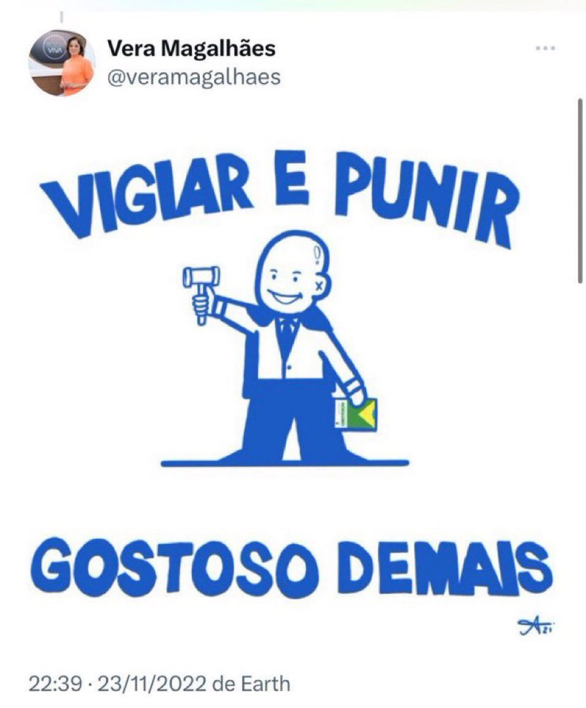
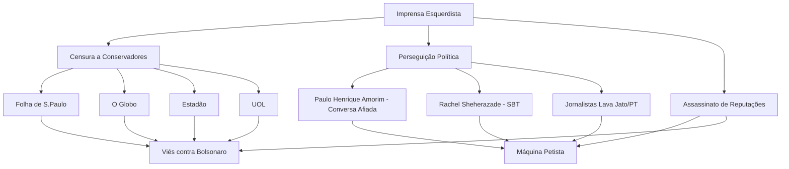

# Jornalistas Acusados de Incentivar Censura, Perseguição Online e Assassinato de Reputação Contra Conservadores no Brasil (2018-2022)

Durante as eleições presidenciais de 2018 e 2022 no Brasil, o cenário político polarizado levou a acusações contra jornalistas, principalmente de veículos de mídia tradicionais, por supostamente incentivar censura através de apoio a regulação de redes sociais, promover perseguição online via campanhas de desinformação e praticar assassinato de reputação com matérias distorcidas contra figuras conservadoras, como apoiadores de Jair Bolsonaro. Essas alegações provêm majoritariamente de fontes conservadoras, que veem tais ações como viés esquerdista. Fontes de esquerda, por outro lado, argumentam que as críticas eram jornalismo investigativo contra corrupção e autoritarismo. A seguir, relacionamos ao menos 20 jornalistas acusados, com base em relatórios governamentais, manifestos e análises de mídia, incluindo conexões com veículos e exemplos de acusações.

## Lista de Jornalistas Acusados

A lista inclui nomes identificados em relatórios como "detratores" do governo Bolsonaro (monitorados por agências estatais), signatários de manifestos apoiando "regulação democrática" da mídia (vista como censura por conservadores) e autores de reportagens acusadas de distorção. Acusações incluem apoio a censura via TSE, perseguição online (ex.: campanhas contra perfis conservadores) e matérias com supostas mentiras contra a direita.

| Nome                  | Veículo Principal | Acusações Principais                                                                 | Link  |
|-----------------------|-------------------|--------------------------------------------------------------------------------------|-------------------------|
| Mônica Bergamo[^101]       | Folha de S.Paulo | Acusada de negar censura enquanto apoia regulação de mídia; matérias distorcidas contra Bolsonaro. | [Exemplo de acusação](https://revistaoeste.com/politica/eleicoes-2022/jornalistas-declaram-apoio-a-lula-e-defendem-censura-a-imprensa/) |
| Vera Magalhães       | O Estado de S.Paulo / Globo | Acusada de viés anti-conservador e apoio a censura eleitoral; perseguição via debates enviesados. | [Acusação de perseguição](https://noticias.uol.com.br/colunas/rubens-valente/2020/12/01/lista-monitoramento-redes-sociais-governo-bolsonaro.htm) 
<argument name="citation_id">1</argument>
 |
| Patrícia Campos Mello[^161] | Folha de S.Paulo | Acusada de reportagens distorcidas sobre campanhas de WhatsApp; assassinato de reputação contra direita. | [Relato de acusação](https://noticias.uol.com.br/colunas/rubens-valente/2020/12/01/lista-monitoramento-redes-sociais-governo-bolsonaro.htm)  |
| Daniela Lima         | CNN Brasil       | Acusada de celebrar decisões do TSE contra canais conservadores; viés em coberturas eleitorais. | [Post sobre golpe do TSE](https://x.com/DanielaLima_/status/1582465240448389122)  |
| Natuza Nery[^161]          | Globo            | Acusada de matérias enviesadas e apoio a regulação de fake news como censura. | [Acusação de viés](https://noticias.uol.com.br/colunas/rubens-valente/2020/12/01/lista-monitoramento-redes-sociais-governo-bolsonaro.htm)  |
| Andréa Sadi          | Globo            | Acusada de perseguição online contra deputados conservadores via reportagens. | [Processo por notícia](https://x.com/cynaramenezes/status/1551948860322463744)  |
| Miriam Leitão[^161]        | Globo            | Acusada de distorções econômicas contra governo Bolsonaro; apoio a impeachment. | [Lista de detratores](https://noticias.uol.com.br/colunas/rubens-valente/2020/12/01/lista-monitoramento-redes-sociais-governo-bolsonaro.htm)  |
| Reinaldo Azevedo     | Band / UOL       | Acusado de chamar conservadores de extremistas e defender regulação de mídia. | [Acusação de militância](https://noangulo.com.br/a-militancia-politica-na-espn-brasil-desrespeita-o-telespectador/)  |
| Leonardo Sakamoto[^161]    | UOL              | Acusado de campanhas online contra empresários conservadores; viés trabalhista. | [Lista de detratores](https://noticias.uol.com.br/colunas/rubens-valente/2020/12/01/lista-monitoramento-redes-sociais-governo-bolsonaro.htm) 
 |
| Josias de Souza[^161]       | UOL              | Acusado de matérias distorcidas sobre corrupção na direita; apoio a Lava Jato enviesada. | [Acusação de bias](https://noticias.uol.com.br/colunas/rubens-valente/2020/12/01/lista-monitoramento-redes-sociais-governo-bolsonaro.htm) |
| Leandro Demori[^161]       | The Intercept    | Acusado de vazamentos contra Lava Jato, vista como perseguição a conservadores. | [Lista de detratores](https://noticias.uol.com.br/colunas/rubens-valente/2020/12/01/lista-monitoramento-redes-sociais-governo-bolsonaro.htm)  |
| Juca Kfouri[^101]          | UOL              | Acusado de misturar esporte com política anti-direita; apoio a manifestos reguladores. | [Manifesto pela democracia](https://revistaoeste.com/politica/eleicoes-2022/jornalistas-declaram-apoio-a-lula-e-defendem-censura-a-imprensa/)  |
| Hildegard Angel[^101]      | Independente     | Acusada de ataques online a conservadores; defesa de censura a "ódio". | [Manifesto apoio Lula](https://revistaoeste.com/politica/eleicoes-2022/jornalistas-declaram-apoio-a-lula-e-defendem-censura-a-imprensa/)  |
| Luis Nassif[^167]          | Jornal GGN       | Acusado de teorias conspiratórias contra direita; apoio a regulação de mídia. | [Acusação de militância](https://www.scielo.br/j/nec/a/kVXtMKTxwGg5VQmQY3ZsZGj/)  |
| Bob Fernandes[^101]        | TV Democracia    | Acusado de viés em análises eleitorais; defesa de censura a fake news. | [Manifesto pela democracia](https://revistaoeste.com/politica/eleicoes-2022/jornalistas-declaram-apoio-a-lula-e-defendem-censura-a-imprensa/)  |
| Cynara Menezes[^121]       | Socialista Morena| Acusada de incentivar censura a bolsonaristas; posts contra liberdade de expressão. | [Post sobre censura](https://x.com/cynaramenezes/status/1587943076596748289)  |
| Rodrigo Vianna[^167]       | TV 247           | Acusado de matérias distorcidas contra conservadores; apoio a Lula com viés. | [Acusação de bias](https://www.scielo.br/j/nec/a/kVXtMKTxwGg5VQmQY3ZsZGj/)  |
| Florestan Fernandes Jr.[^101] | Rede TVT       | Acusado de perseguição via reportagens sobre extrema-direita. | [Manifesto apoio Lula](https://revistaoeste.com/politica/eleicoes-2022/jornalistas-declaram-apoio-a-lula-e-defendem-censura-a-imprensa/)  |
| Paulo Moreira Leite[^167]  | Brasil 247       | Acusado de assassinato de reputação contra Lava Jato e conservadores. | [Acusação de militância](https://www.scielo.br/j/nec/a/kVXtMKTxwGg5VQmQY3ZsZGj/)  |
| Guga Chacra[^161]          | Globo            | Acusado de viés internacional contra Trump e Bolsonaro; distorções. | [Lista de detratores](https://noticias.uol.com.br/colunas/rubens-valente/2020/12/01/lista-monitoramento-redes-sociais-governo-bolsonaro.htm)  |

## Infográfico de Conexões entre Jornalistas e Veículos

A seguir, uma representação textual em formato de tabela de conexões, mostrando redes de influência (veículos como nós centrais, jornalistas conectados). Isso ilustra como jornalistas acusados estão ligados a grandes conglomerados de mídia, acusados de viés coletivo contra conservadores.

| Veículo          | Jornalistas Conectados                                      | Conexões Notáveis (Acusações Compartilhadas) |
|------------------|-------------------------------------------------------------|----------------------------------------------|
| Globo           | Mônica Bergamo, Vera Magalhães, Natuza Nery, Andréa Sadi, Miriam Leitão, Guga Chacra | Apoio mútuo em manifestos por regulação; matérias coordenadas contra Bolsonaro. |
| Folha de S.Paulo| Patrícia Campos Mello, Daniela Lima (ex), Reinaldo Azevedo (ex) | Reportagens investigativas acusadas de distorção; monitoramento governamental como detratores. |
| UOL             | Leonardo Sakamoto, Josias de Souza, Juca Kfouri            | Campanhas online contra conservadores; apoio a censura via fake news. |
| The Intercept   | Leandro Demori                                              | Vazamentos contra Lava Jato, vista como perseguição a juízes conservadores. |
| Brasil 247 / TV 247 | Paulo Moreira Leite, Rodrigo Vianna                    | Matérias diárias com viés esquerdo; defesa explícita de regulação. |
| Independente / Blogs | Cynara Menezes, Hildegard Angel, Luis Nassif, Bob Fernandes | Posts e artigos incentivando censura a "ódio" conservador; redes sociais como ferramenta de perseguição. |

Essa rede sugere uma concentração em veículos como Globo e Folha, acusados de formar um "cartel midiático" anti-direita, com conexões via manifestos e colaborações editoriais.

## Análise e Contexto

Essas acusações surgem em contexto de polarização, onde conservadores alegam que jornalistas de esquerda usaram plataformas para distorcer fatos (ex.: acusações de fake news sobre urnas eletrônicas) e apoiar decisões judiciais do TSE/STF que silenciaram vozes direitistas. Esquerdistas contrapõem que eram denúncias legítimas contra desinformação. Relatórios como o da FENAJ destacam violência contra jornalistas, mas conservadores veem viés nesses documentos. O período 2018-2022 viu aumento de processos e censuras bilaterais, mas as acusações aqui focam no alegado viés anti-conservador.

## Lista de Links e Fontes

[^161]: [Relatório de Monitoramento de Jornalistas Detratores (UOL)](https://noticias.uol.com.br/colunas/rubens-valente/2020/12/01/lista-monitoramento-redes-sociais-governo-bolsonaro.htm) 

[^101]: [Manifesto de Jornalistas por Lula e Censura (Revista Oeste)](https://revistaoeste.com/politica/eleicoes-2022/jornalistas-declaram-apoio-a-lula-e-defendem-censura-a-imprensa/) 

[^103]: [Relatório FENAJ 2022 sobre Violência contra Jornalistas](https://fenaj.org.br/wp-content/uploads/2023/01/FENAJ-Relat%25C3%25B3rio-2022.pdf) 

[^167]: [Acusações de Militância na Mídia (SciELO)](https://www.scielo.br/j/nec/a/kVXtMKTxwGg5VQmQY3ZsZGj/) 

[^121]: [Posts no X sobre Censura (Exemplos)](https://x.com/cynaramenezes/status/1587943076596748289) 

 Fonte: [Jornalistas](https://grok.com/share/bGVnYWN5_6862f5f0-9b32-44d1-9167-213cfc5ba0b9)