## Interferência dos EUA nas eleições brasileiras de 2022

O documento é um artigo investigativo de David Agape, publicado em 18 de maio de 2025, alegando interferência dos EUA nas eleições brasileiras de 2022 para favorecer Lula da Silva contra Jair Bolsonaro. Batizado como "Operação Tio Joe" (referência à Operação Brother Sam de 1964), o texto descreve uma rede de pressões diplomáticas, visitas oficiais, financiamento de ONGs e mecanismos de censura, coordenados para "blindar" o processo eleitoral. Abaixo, os pontos principais categorizados com emojis relacionados:

- 🇺🇸 **Interferência Diplomática Geral**: Os EUA atuaram de forma sutil via cartas, declarações públicas e apoio institucional, contrastando com intervenções armadas passadas. A esquerda brasileira, antes crítica, agora aceita essa influência contra adversários.
  
- 👨‍⚖️ **Papel do Judiciário Brasileiro**: Ministro Luís Roberto Barroso admitiu pedir ajuda aos EUA para conter "onda autoritária", reunindo-se com diplomatas americanos. Isso incluiu solicitações para notas de apoio ao TSE, visando intimidar militares brasileiros.

- 🕵️‍♂️ **Visitas de Oficiais Americanos**: Série de encontros estratégicos em 2021-2022, como William Burns (CIA), Jake Sullivan, Victoria Nuland e Lloyd Austin, para pressionar contra questionamentos eleitorais de Bolsonaro.

- 👥 **Comitivas e Redes Paralelas**: Uma comitiva brasileira (incluindo ONGs e ativistas) visitou Washington para alertar congressistas democratas sobre riscos de golpe, resultando em declarações públicas e cartas de 39 congressistas.

- 💰 **Financiamento de ONGs e Campanhas**: Entidades como NOSSAS, Girl Up e BONDE, financiadas por fundações americanas (Open Society, USAID), promoveram mobilização de jovens, transporte gratuito e pautas progressistas para aumentar votos pró-Lula.

- 🚫 **Censura e Big Tech**: Remoções de perfis pró-Bolsonaro no Facebook, com suporte do DFRLab (Atlantic Council). Isso integrou o "Complexo Industrial da Censura", financiado por EUA, testado no Brasil antes das eleições americanas.

- 📅 **Linha do Tempo**: Cronologia de eventos, desde visitas em julho de 2021 até agosto de 2022, destacando pressão crescente antes das eleições.

- ⚖️ **Consequências e Ironias**: A narrativa de "defesa da democracia" justificou censura seletiva e prisões políticas. No governo Lula, há continuidade com parcerias autoritárias (ex.: China via TikTok), aprofundando controle informacional.

O artigo critica a seletividade da interferência, alegando que o foco não é a democracia, mas o controle político.

## Artigo para Publicação: A Interferência Americana nas Eleições Brasileiras de 2022

### Introdução

Em 2022, as eleições presidenciais no Brasil foram marcadas por alegações de interferência externa, não oriundas de atores conservadores, mas de uma coalizão progressista apoiada pelos Estados Unidos. Batizada como "Operação Tio Joe" pelo jornalista Cláudio Dantas, essa influência sutil visava "blindar" o processo eleitoral para favorecer Luiz Inácio Lula da Silva contra Jair Bolsonaro. Este artigo resume as evidências apresentadas em uma investigação recente, destacando mecanismos diplomáticos, financeiros e censórios.

### Pressões Diplomáticas e Judiciais

O ministro do STF Luís Roberto Barroso confessou, em maio de 2025, ter solicitado ajuda americana para conter supostas ameaças autoritárias. Reuniu-se com diplomatas dos EUA, resultando em notas públicas de apoio ao TSE. Essa articulação visava intimidar as Forças Armadas brasileiras, dependentes de treinamento e equipamentos americanos.

Visitas de alto escalão reforçaram a pressão:
- Julho de 2021: William Burns (CIA) se reuniu com Bolsonaro e assessores.
- Agosto de 2021: Jake Sullivan e Juan González discutiram "democracia".
- Abril de 2022: Victoria Nuland elogiou o sistema eleitoral brasileiro.
- Agosto de 2022: Lloyd Austin enfatizou cooperação militar.

Uma comitiva brasileira, incluindo ativistas de ONGs, alertou congressistas democratas sobre riscos de golpe, levando a cartas e declarações internacionais.

### Financiamento de Campanhas e Mobilizações

ONGs financiadas por fundações americanas, como Open Society e USAID, impulsionaram iniciativas para aumentar a participação eleitoral em segmentos favoráveis a Lula:
- Campanhas para jovens via NOSSAS e Girl Up, com celebridades como Anitta e Leonardo DiCaprio.
- Movimento Passe Livre pela Democracia, garantindo transporte gratuito nos dias de votação.
Essas ações, apresentadas como espontâneas, integravam uma estratégia de mobilização digital via plataformas como BONDE.

### O Complexo Industrial da Censura

Plataformas como Facebook removeram perfis pró-Bolsonaro com base em relatórios do DFRLab, financiado por EUA e OTAN. Isso testou mecanismos de censura global, posteriormente aplicados nas eleições americanas. Financiadores incluem NED e Departamento de Estado, que apoiaram checagens e moderações no TSE e STF.

### Conclusão

A "Operação Tio Joe" revela uma ironia: a esquerda, historicamente anti-imperialista, agora endossa intervenções americanas contra opositores. No governo Lula, parcerias com regimes como a China (via TikTok) perpetuam o controle informacional. Essa dinâmica ameaça a soberania e a liberdade de expressão, transformando o Brasil em laboratório de engenharia social global.

*Fonte: Investigação de David Agape (2025).*

## Mapa Mental dos Tópicos Encontrados

Abaixo, uma representação em formato Mermaid (compatível com Markdown em plataformas como GitHub) de um mapa mental hierárquico dos tópicos principais:

```mermaid
mindmap
  root((Operação Tio Joe))
    Introdução
      Interferência EUA em 2022
      Comparação com Brother Sam
    Judiciário
      Confissão de Barroso
      Apoio ao TSE
    Diplomacia
      Visitas oficiais
        CIA e Assessores Biden
      Comitivas brasileiras
    Financiamento
      ONGs e Campanhas
        Mobilização jovens
        Transporte gratuito
    Censura
      Big Tech e Remoções
      Complexo Industrial
        DFRLab e NED
    Linha do Tempo
      Eventos 2021-2022
    Conclusão
      Ironias e Consequências
```

## Operação Tio Joe

### Interferência Internacional
- 🌍 Alega-se que houve interferência internacional significativa nas eleições brasileiras de 2022.
- 🇧🇷 Organizações de esquerda e ONGs financiadas por fundações estrangeiras apoiaram a vitória de Lula.

### Operação Tio Joe
- 📖 Comparação com "Operação Brother Sam" de 1964, mas com influência mais sutil.
- 💼 Pressão diplomática e visitas de altos escalões como estratégias de influência.

### Duplo Padrão
- ⚖️ Ironia da esquerda defendendo a interferência dos EUA após condená-la anteriormente.
- 📜 Ameaça percebida em 2022 considerada fabricada em comparação com o conflito armado de 1964.

### Confissões de Barroso
- 🎤 Ministro Barroso admitiu buscar ajuda dos EUA contra uma "onda autoritária".
- 🗣️ Pedido de declarações públicas de apoio ao sistema eleitoral brasileiro.

### Pressão Diplomática
- 🤝 Reuniões de Barroso com diplomatas dos EUA, destacando apoio à democracia brasileira.
- 📢 Declarações da Embaixada dos EUA reafirmando a confiança nas instituições brasileiras.

### Visitas Estratégicas
- ✈️ Visitas de oficiais da administração Biden ao Brasil entre 2021 e 2022 para mostrar confiança nas pesquisas.
- 🔍 Vigilância política e contenção institucional foram supostamente objetivos dessas visitas.

### Envolvimento da CIA
- 🕵️‍♂️ Visita de William Burns, diretor da CIA, em julho de 2021, caracterizada como operações psicológicas.
- ⚠️ Encontro com Bolsonaro apresentado como preocupação democrática, mas com foco em sabotagem institucional.

### Mobilizações de Autoridades Americanas
- 🗓️ A visita do Secretário de Defesa Lloyd Austin em agosto de 2022 reforçou mensagens contra questionamentos eleitorais.
- 📣 Antony Blinken e Joe Biden reforçaram a narrativa de golpe no Brasil.

### Atuação do Washington Brazil Office (WBO)
- 🏛️ Comitiva do WBO buscou apoio internacional contra Bolsonaro.
- 📅 Reuniões com diplomatas e parlamentares democratas para reforçar a narrativa eleitoral.

### Contraste no Tratamento de Figuras Políticas
- 🔄 Diferença de tratamento entre a esquerda e a direita nas relações com os EUA.
- 🤔 Caso de Eduardo Bolsonaro destaca a interpretação política das ações.

### Ação de ONGs Financiadas
- 💰 ONGs como Quid e NOSSAS atuaram para impulsionar o eleitorado jovem a favor de Lula.
- 🌱 Fundações como Open Society e OAK foram mencionadas como financiadoras.

### Mobilizações Digitais e Narrativas
- 📲 Campanhas como "Passe Livre pela Democracia" integraram uma estratégia de ocupação do debate público.
- ⚡ Movimentos apresentados como espontâneos, mas com ligação a um projeto político articulado.

Fonte: [ainvestigacao](https://www.ainvestigacao.com/p/operacao-tio-joe-a-influencia-dos)